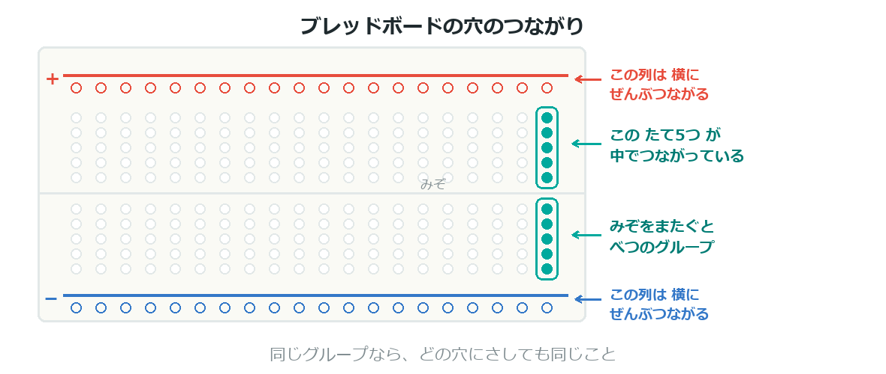
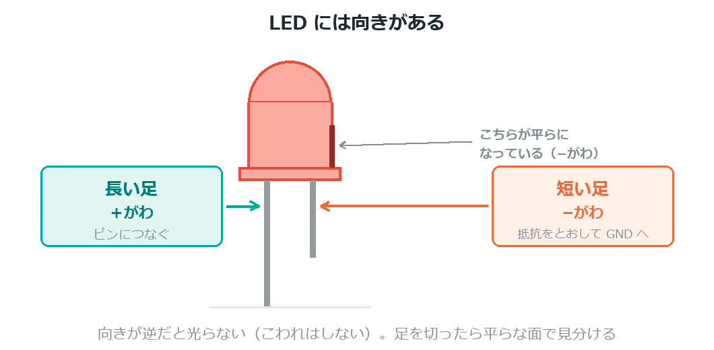
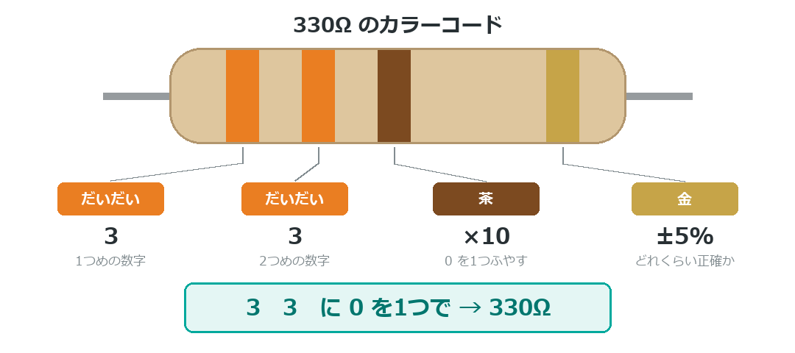
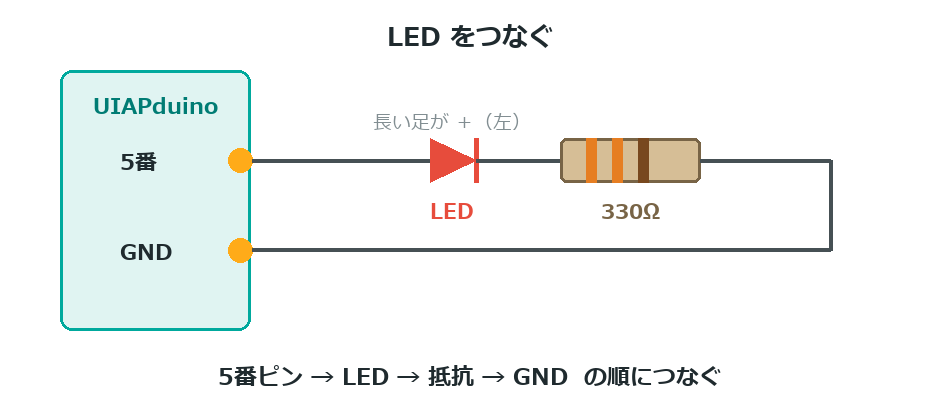

{cover}
# ① ブレッドボードにLEDをつなごう

自分でつないだLEDを光らせる

*UIAPduino 体験ワークショップ*

---

# なにをするの？

:::

前の章では、基板についているLEDを光らせたね。
こんどは**自分でつないだLED**を光らせるよ。

- **ブレッドボード**の使い方をおぼえる
- LEDの**向き**と**抵抗**をおぼえる
- プログラムは**数字を1つ変えるだけ**

> ここができると、つなぐ部品を自由に増やせるようになるよ。

:::

> 📷 ブレッドボードにLEDをつないで光らせた写真

---

# ブレッドボードのしくみ

:::

はんだ付けをしなくても、**さして つなぐ**ことができる板だよ。

- **たて5つの穴**が、中でつながっている
- 横のならびは**つながっていない**
- まん中のみぞをまたぐと**べつのグループ**

> 同じグループの穴なら、どこにさしても同じことだよ。

:::



---

# LEDには向きがある

:::

LEDは**向きが逆だと光らない**（こわれはしないよ）。

- **長い足** … ＋がわ。ピンにつなぐ
- **短い足** … −がわ。抵抗をとおして GND へ

> ⚠ 足を切ってしまうと見分けられなくなる。
> そのときは**中の大きいほうの金具**が−がわだよ。

:::



---

# なぜ抵抗がいるの？

:::

LEDは**電気を流しすぎるとこわれる**。抵抗は「流れる量をおさえる係」だよ。

- 使うのは **330Ω**（オーム）
- 色の帯は **だいだい・だいだい・茶**
- 抵抗に**向きはない**。どちら向きでもOK

> ⚠ 抵抗を入れずにつなぐと、LEDが一瞬で切れてしまうよ。

> 読み方は付録の「**カラーコードの読み方**」を見てね。

:::



---

# つないでみよう

:::

**USBケーブルを抜いてから**つなごう。

1. **赤**のLEDをブレッドボードにさす
2. LEDの**短い足**と同じたてならびに、**抵抗**をさす
3. 抵抗のもう一方を **GND** につなぐ
4. LEDの**長い足**を **5番ピン**につなぐ

> ⚠ 配線を変えるときは、かならずUSBを抜いてからにしよう。

:::

> 📷 配線のようすを真上から撮った写真（ピン名を書きこむ）



---

# プログラムを書きこもう

:::

前の章のプログラムと、ちがうのは**数字1つだけ**。

1. `const int LED = 2;` を **`5`** に変える
2. いつもの手順で書きこむ
3. ブレッドボードのLEDが点滅したら成功！ 🎉

> `2` は基板のLED、`5` はブレッドボードのLED。
> **番号を変えると、光るLEDが変わる**んだ。

:::

```cpp `b1_led` 外づけLEDのLチカ
const int LED = 5;          // 赤のLED

void setup() {
  pinMode(LED, OUTPUT);
}

void loop() {
  digitalWrite(LED, HIGH);
  delay(500);
  digitalWrite(LED, LOW);
  delay(500);
}
```

---

# 💪 やってみよう

赤が光ったら、色をふやしていこう。

1. **緑**のLEDを **7番**に足す（抵抗も1本ずつ）
2. 赤と緑を**かわりばんこ**に光らせる
3. **青**を **8番**に足して、3色を順番に光らせる

> ⚠ LEDをふやすときは、**1つずつに抵抗**をつけてね。

> 💪 3色をずらして光らせると、どんな見え方になるかな？
