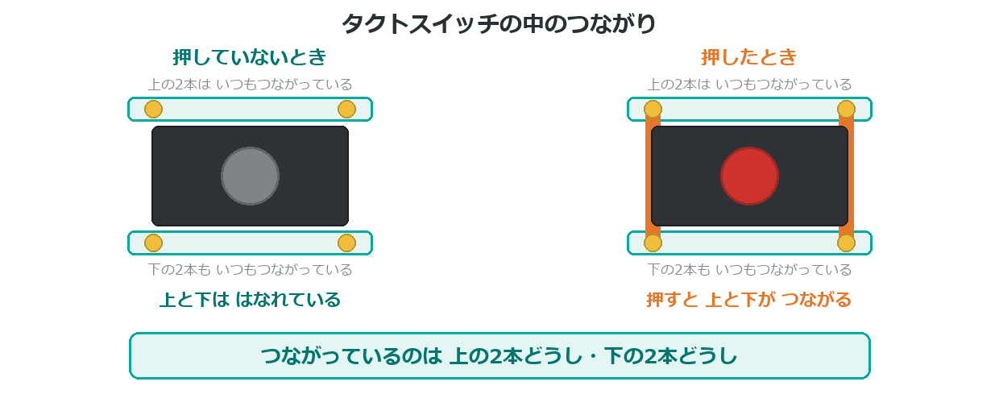
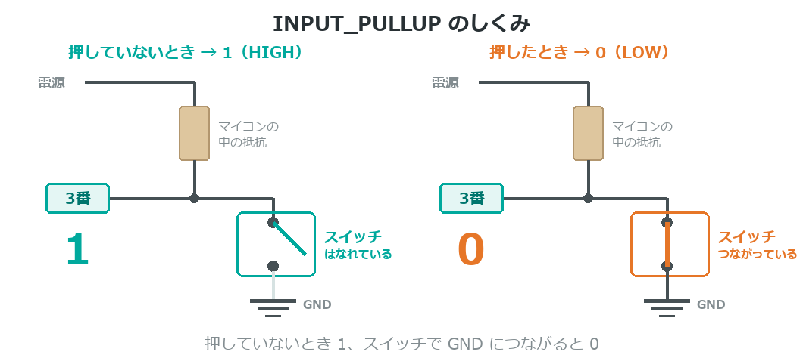
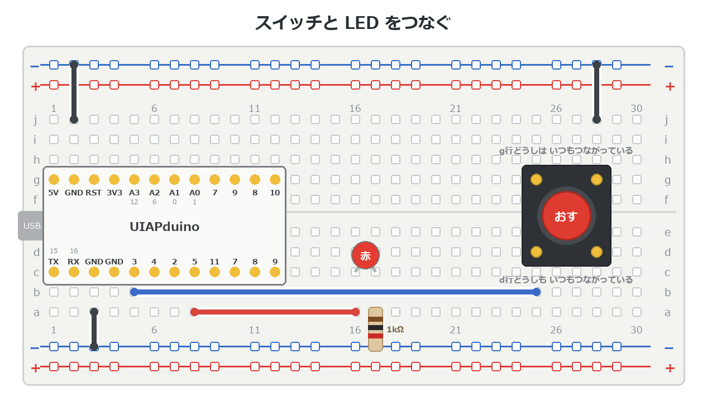

{cover}
# ② スイッチでLEDをつけよう

押したときだけ光らせる

*UIAPduino 体験ワークショップ*

---

# なにをするの？

:::

ここまでは、マイコンから**出す**ばかりだった。
こんどは**読みとる**ことをおぼえるよ。

- スイッチが押されたかを `digitalRead` で読む
- 読んだ結果でLEDをつけたり消したり
- デジタルは **0 か 1 の2つだけ**

> 「感じて → 考えて → 動かす」の**感じて**の部分だね。

:::

> 📷 スイッチを押してLEDが光っている写真

---

# タクトスイッチのしくみ

:::

足は**4本**あるけれど、中のスイッチは**1つだけ**なんだ。

- **上の2本どうし・下の2本どうし**は、もともとつながっている
- **押すと**、上と下がつながる

> ⚠ 90度まちがえてさすと、押していなくてもつながったままになる。
> LEDが光りっぱなしなら、**回してさしなおして**みよう。

:::



---

# ⚠ 押すと 0 になる

:::

このつなぎ方では、**押していないとき 1、押すと 0** になるよ。

- `INPUT_PULLUP` ＝「何もないときは 1」にするしくみ
- スイッチのもう片方は **GND** につなぐ
- 押すと GND とつながって **0** になる

> ⚠ **押していないほうが 1**。ぎゃくだけど、そう決まっているんだ。

:::



---

# つないでみよう

:::

**USBケーブルを抜いてから**つなごう。LEDは前の章のままでOK。

1. タクトスイッチをブレッドボードのみぞをまたいでさす
2. 片方の足を **3番ピン**につなぐ
3. 反対がわの足を **GND** につなぐ

> スイッチには向きがない（＋−がない）ので、
> **どちらの足を3番にしてもOK**だよ。

:::



---

# プログラムを書きこもう

:::

`if` は「**もし〜なら**」。制御編③でくわしくやるけど、先に使ってみよう。

1. 右のプログラムを書きこむ
2. スイッチを押すとLEDが光る
3. はなすと消える

> `==` は「同じかどうか」を調べる記号。
> `=`（1つ）とは意味がちがうので気をつけて。

:::

```cpp `b2_switch` スイッチでLEDをつける
const int SW  = 3;
const int LED = 5;

void setup() {
  pinMode(SW, INPUT_PULLUP);
  pinMode(LED, OUTPUT);
}

void loop() {
  if (digitalRead(SW) == LOW) {   // 押された
    digitalWrite(LED, HIGH);
  } else {
    digitalWrite(LED, LOW);
  }
}
```

---

# 💪 やってみよう

数字と記号を変えて、動きのちがいを見てみよう。

1. `LOW` を `HIGH` に変えると、どうなる？
2. スイッチを**2つ**にして、それぞれちがうLEDを光らせる
3. 「押しているあいだだけ点滅する」ようにしてみる

> 💪 押すと**音が鳴る**ようにもできるよ（b5 のブザーと組み合わせ）。

> 「押すたびにON/OFFが入れかわる」は、じつはむずかしい。
> 1回押しただけで**何回も押したこと**になってしまうんだ（チャタリング）。
