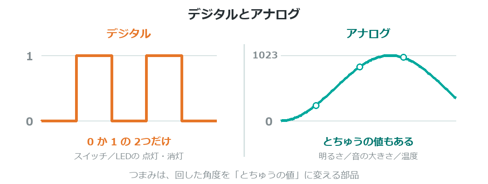
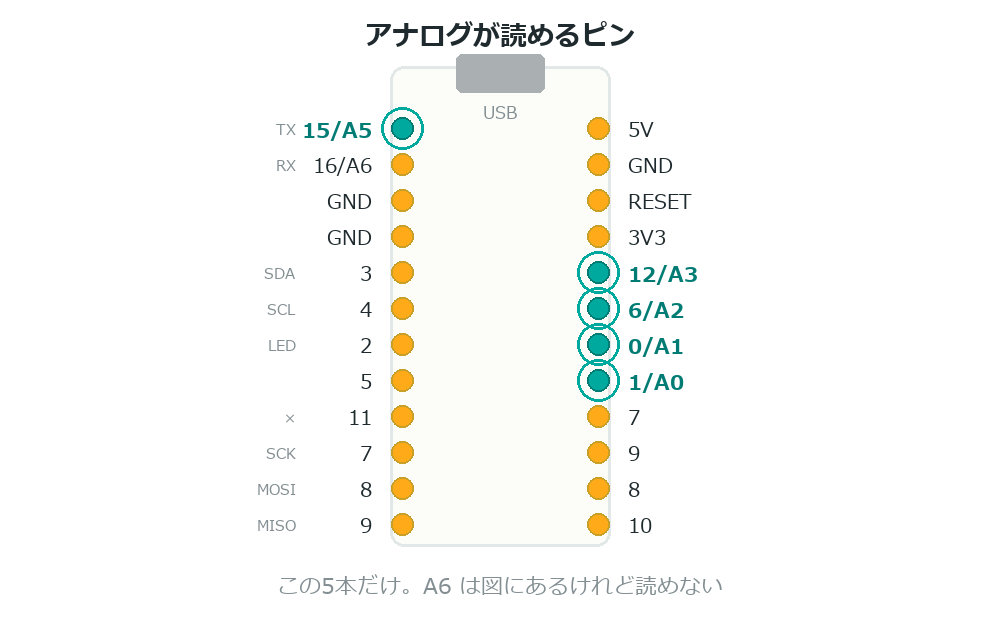

{cover}
# ④ つまみで明るさを変えよう

アナログの値を読む

*UIAPduino 体験ワークショップ*

---

# なにをするの？

:::

スイッチは「押した／押していない」の**2つだけ**だった。
こんどは**とちゅうの値**を読みとるよ。

- `analogRead` で **0〜1023** の値を読む
- つまみを回すと、LEDの明るさがぬるっと変わる
- **読んだ値をそのまま明るさにする**

> 「感じて → 考えて → 動かす」が、1本のプログラムでつながるよ。

:::

> 📷 つまみを回してLEDの明るさが変わっている写真（2〜3枚）

---

# デジタルとアナログ

:::

2つのちがいをおぼえよう。

- **デジタル** … `0` か `1` だけ。スイッチ、LEDの点灯・消灯
- **アナログ** … とちゅうがある。明るさ、音の大きさ、温度

つまみ（可変抵抗）は、回した角度を**電圧の高さ**に変える部品だよ。

> スイッチと、水道のじゃぐち。じゃぐちは**とちゅうで止められる**ね。

:::



---

# つまみをつなごう

:::

**USBケーブルを抜いてから**つなごう。足が3本あるよ。

1. 両はしの片方を **5V** につなぐ
2. 反対のはしを **GND** につなぐ
3. **まん中の足**を **A2** につなぐ

> ⚠ まん中が読みとる線。両はしは**逆でもOK**（回す向きが逆になるだけ）。

:::


---

# ⚠ 読めるピンは決まっている

:::

`analogRead` が使えるのは、**この5本だけ**だよ。

- **`A0` `A1` `A2` `A3` `A5`**

図には `A6` もあるけれど、いまのプログラムでは**読みとれない**。

> `A2` は「デジタルの6番」でもある。**両方の顔を持つピン**なんだ。
> `analogRead(A2)` と書けば、アナログとして読んでくれるよ。

:::



---

# プログラムを書きこもう

:::

読んだ値を、そのまま明るさにするよ。

1. 右のプログラムを書きこむ
2. つまみをゆっくり回す
3. LEDの明るさが**なめらかに**変われば成功！ 🎉

> `/ 4` は「4でわる」という意味。
> 読んだ値は **0〜1023**、明るさは **0〜255** なので、**4でわって**合わせているんだ。

:::

```cpp `b4_analog` つまみで明るさを変える
const int VR  = A2;   // つまみ
const int LED = 5;

void setup() {
  pinMode(LED, OUTPUT);
  analogWriteResolution(8);
}

void loop() {
  int value = analogRead(VR);    // 0〜1023
  analogWrite(LED, value / 4);   // 0〜255
  delay(10);
}
```

---

# ⚠ 数字は見えない
このボードは**シリアルモニタが使えない**んだったね。
だから **LEDの明るさが数字のかわり**だよ。

- 明るい ＝ 大きい数
- 暗い ＝ 小さい数

> 数字が見えなくても、**目で見て確かめる**ことはできる。

---

# 💪 やってみよう

わり算のところを変えて、動きのちがいを見てみよう。

1. `/ 4` を `/ 8` にすると、どうなる？
2. `/ 4` を `/ 2` にすると、どうなる？
3. `255 - value / 4` にすると、回す向きと明るさの関係が**逆**になる

> 💪 `value / 4` を `map(value, 0, 1023, 0, 255)` に書きかえてみよう。
> `map` は「この範囲の数を、あの範囲に置きかえる」便利な命令だよ。

> 💪 つまみで**点滅の速さ**が変わるようにもできる（`delay` に使ってみよう）。
