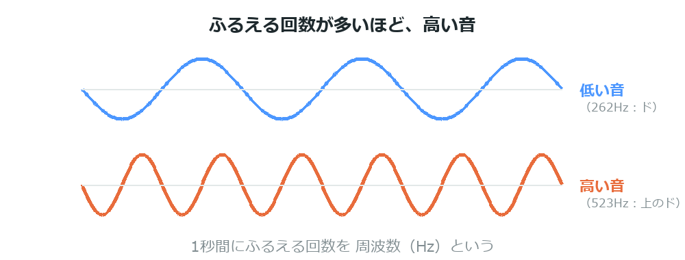
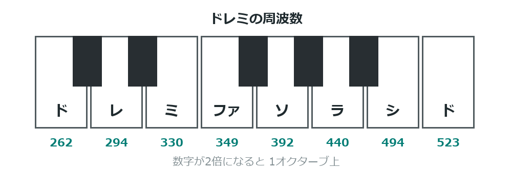

{cover}
# ⑤ 音を鳴らそう

高い音・低い音をつくる

*UIAPduino 体験ワークショップ*

---

# なにをするの？

:::

光につづいて、こんどは**音**を出してみよう。

- `tone()` で音を鳴らし、`noTone()` で止める
- 数字を変えると**音の高さ**が変わる
- ドレミを鳴らして、メロディを作る

> 光と音がそろえば、作れるものがぐっと広がるよ。

:::

> 📷 ブザーをつないで鳴らしている写真

---

# 音の高さって、なに？

:::

音は**空気のふるえ**。ふるえる回数が多いほど**高い音**になる。

- 1秒間の回数を **Hz（ヘルツ）** という
- ラの音 ＝ **440Hz**
- 数字が2倍で、ちょうど**1オクターブ上**

> `tone(7, 440)` ＝「7番を1秒に440回ふるわせて」という意味。

:::



---

# ブザーをつなごう

:::

**USBケーブルを抜いてから**つなごう。

1. ブザーの片方を **7番ピン**につなぐ
2. もう片方を **GND** につなぐ

> ＋の印があればその向きに。無ければどちら向きでもOK。
> ⚠ 音の高さが変わらないときは**受動ブザー**か確かめよう。

:::

> 📷 ブザーの配線を写した写真

---

# なぜ 7番ピン？
`tone()` は**どのピンでも鳴らせる**。それでも7番なのには理由があるよ。

- **5番・6番は明るさを変えられる貴重なピン**
- 音はどこでも鳴るので、**そちらにゆずる**

> 「その部品にしかできないこと」を考えてピンを割りふる。
> これもものづくりの工夫だよ。

---

# プログラムを書きこもう

:::

ドレミを順番に鳴らすよ。

1. 右のプログラムを書きこむ
2. ド・レ・ミ と鳴って、少し休んでくりかえす
3. 数字を変えて、音の高さを確かめよう

> `DO` `RE` `MI` は**自分でつけた名前**。
> 数字のままでも動くけど、名前をつけると読みやすいね。

:::

```cpp ドレミを鳴らす
const int BUZZER = 7;
const int DO = 262, RE = 294, MI = 330;

void setup() { }

void loop() {
  tone(BUZZER, DO);  delay(400);
  tone(BUZZER, RE);  delay(400);
  tone(BUZZER, MI);  delay(400);
  noTone(BUZZER);    delay(1000);
}
```

---

# 音のたかさの表

:::

ドレミファソラシドの周波数だよ。**上のドは、下のドのちょうど2倍**。

- ド **262** ／ レ **294** ／ ミ **330** ／ ファ **349**
- ソ **392** ／ ラ **440** ／ シ **494** ／ ド **523**

> 半分の数字（131, 147, …）にすると**1オクターブ低い音**になるよ。

:::



---

# 💪 やってみよう

音と光を組み合わせてみよう。

1. ドレミファソラシド を**ぜんぶ**鳴らす
2. `delay` を短くして、速いメロディにする
3. 知っている曲を鳴らしてみる（カエルの歌など）

> 💪 音に合わせて**LEDも光る**ようにしてみよう。
> 音とLEDは同時に使えることが確かめてあるよ。

> 💪 b2 のスイッチと組み合わせて、**押すと鳴る楽器**を作ってみよう。
