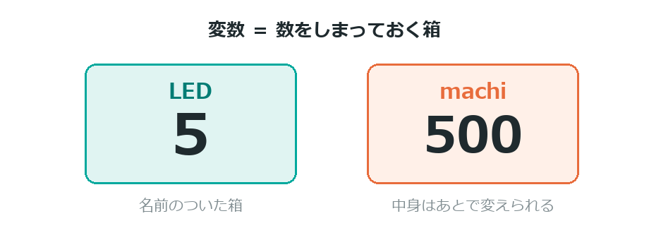
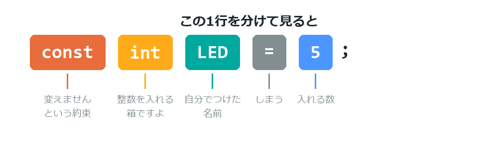
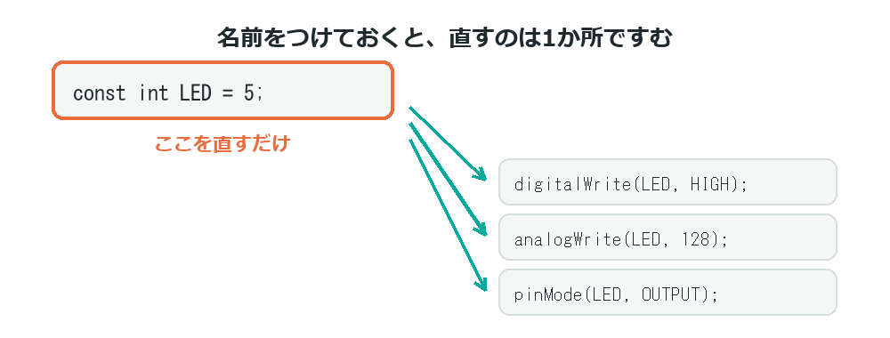
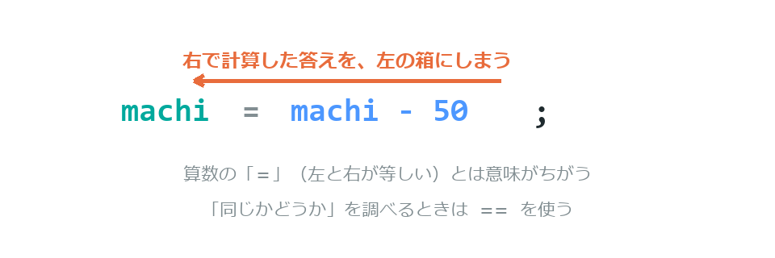

{cover}
# ① 変数をつかおう

数に名前をつける

*UIAPduino 体験ワークショップ*

---

# なにをするの？

:::

ここからは**プログラムの書き方**そのものを学ぶよ。
配線は基本編のまま（LEDが5番）でOK。

- **変数**＝数をしまっておく箱
- 箱には**名前**をつけられる
- 中身は**あとから変えられる**

> じつは、もう最初の章から使っていたんだ。気づいていたかな？

:::



---

# もう使っていた

:::

基本編①でLEDをつないだとき書いた、この行をおぼえているかな。

これは「**5 という数に、LED という名前をつける**」という意味だったんだ。

- `int` … 整数（せいすう）を入れる箱、という印
- `LED` … 自分でつけた名前
- `5` … 中に入れる数

:::
```cpp
const int LED = 5;
```


---

# 名前をつけるといいこと

:::

`digitalWrite(5, HIGH)` でも動く。でも名前をつけたほうがいい。

- **読んで意味が分かる**
- **直すのが1か所ですむ**（配線を変えても最初の1行だけ）

> ⚠ 名前を使わないと、`5` をぜんぶ さがして直すことになるよ。

:::



---

# const がつくと変わらない
`const` は「**この箱の中身は変えません**」という約束だよ。

- `const int LED = 5;` … ずっと 5 のまま（ピン番号など）
- `int akarusa = 0;` … あとから変えられる（明るさ、回数など）

> 変えないものに `const` をつけておくと、
> うっかり書きかえたときに**まちがいだと教えてくれる**んだ。

---

# 中身が変わる箱をつかう

:::

「まつ時間」を箱に入れて、だんだん短くしてみよう。

1. 右のプログラムを書きこむ
2. 点滅がだんだん**速くなる**
3. いちばん速くなったら、また遅くにもどる

> `machi = machi - 50;` は「いまの machi から 50 ひいて、
> それを machi にしまいなおす」という意味だよ。

:::

```cpp `c1_speed` だんだん速くなる点滅
const int LED = 5;
int machi = 500;            // まつ時間（変わる）

void setup() {
  pinMode(LED, OUTPUT);
}

void loop() {
  digitalWrite(LED, HIGH);
  delay(machi);
  digitalWrite(LED, LOW);
  delay(machi);
  machi = machi - 50;       // 50ずつ短く
  if (machi < 50) machi = 500;   // もどす
}
```

---

# ⚠ = はイコールじゃない

:::

算数の `=` とは意味がちがうよ。

- 算数 … 左と右が**等しい**
- プログラム … 右の答えを左の箱に**しまう**

だから `machi = machi - 50;` が成り立つんだ。

> 「同じか」を調べるときは `==`（2つ）を使う。

:::



---

# 💪 やってみよう

箱の中身と、変え方をいじってみよう。

1. `machi = 500` の 500 を変えると、どうなる？
2. `- 50` を `- 100` にすると、どうなる？
3. `machi = machi + 50;` にして、だんだん**遅く**してみる

> 💪 明るさを箱に入れて、だんだん明るくしてみよう
> （`analogWrite` と `analogWriteResolution(8)` を思い出してね）。

> 💪 箱を2つ使って、2つのLEDをちがうテンポで点滅させてみよう。
