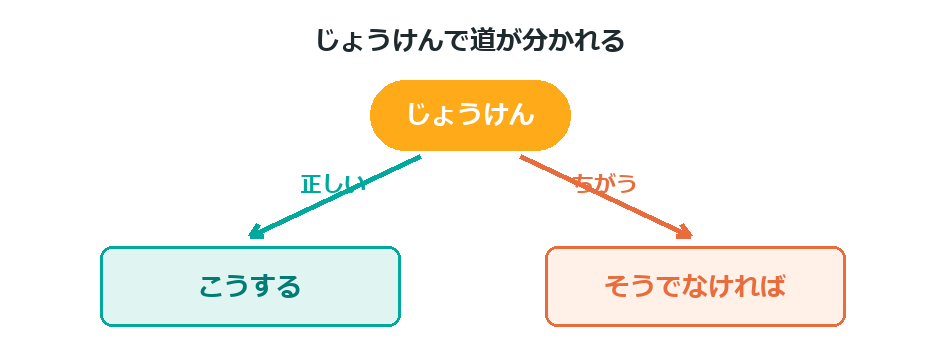
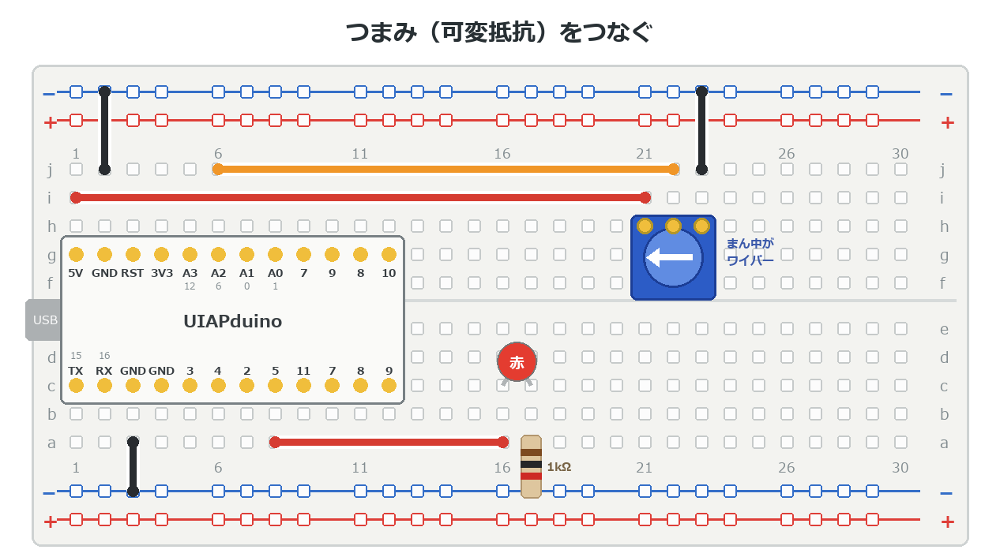
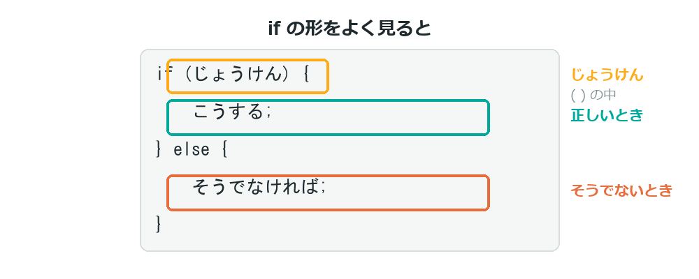
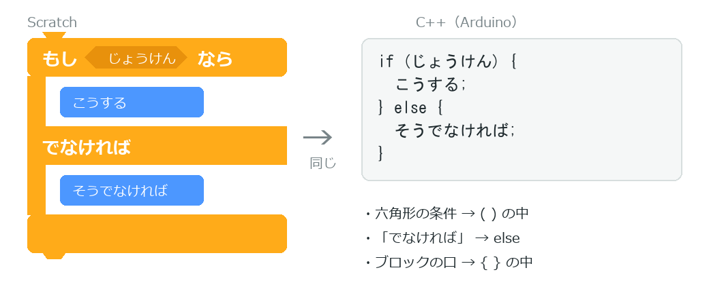
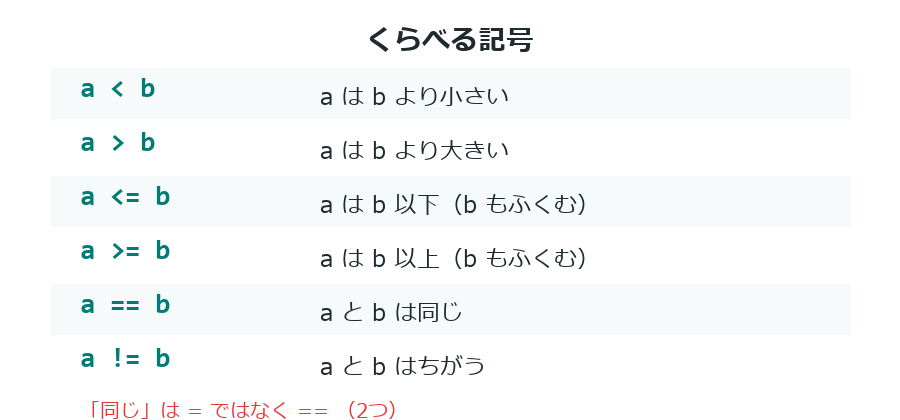
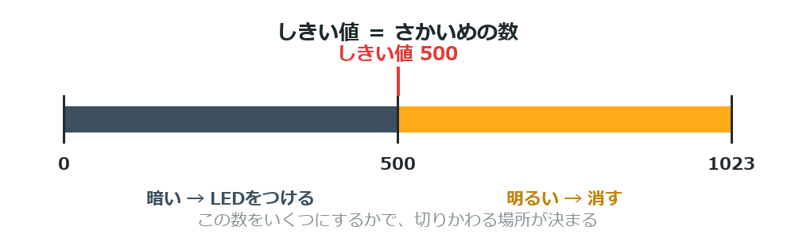
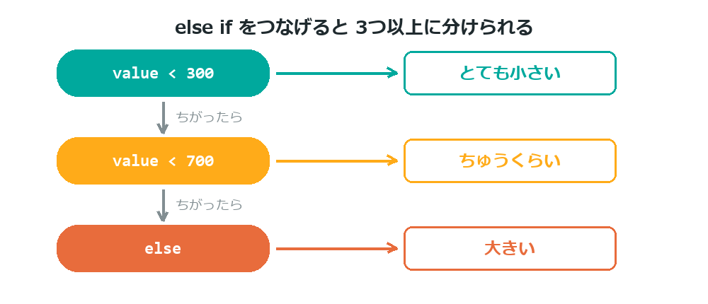

{cover}
# ③ もし〜なら（if / else）

じょうけんで動きを変える

*UIAPduino 体験ワークショップ*

---

# なにをするの？

:::

いままでのプログラムは、上から順に**そのとおり**動くだけだった。
こんどは**状況によって動きを変える**よ。

- `if` … もし〜なら
- `else` … そうでなければ
- くらべる記号（`<` `>` `==`）

> b2 のスイッチで、じつはもう使っていたね。ここでしっかりおぼえよう。

:::



---

# つないでおくもの

:::

つまみと LED を使うよ。基本編④と同じ配線だから、
つづけている人は**そのままでOK**。

1. つまみの**両はし** → **5V** と **− レール**
2. つまみの**まん中** → **A2**
3. **5番ピン** → LED → **1kΩ** → **− レール**

> ⚠ つまみの上は **3V3 ではなく 5V** だよ。

:::



---

# if の形

:::

書き方はこうだよ。

- `else` の部分は、**いらなければ書かなくてOK**
- じょうけんは `( )` の中、やることは `{ }` の中

> 日本語にすると「**もし〜なら、こうする。そうでなければ、こうする**」。

:::
```cpp
if (じょうけん) {
  じょうけんが正しいときにやること
} else {
  そうでないときにやること
}
```


---

# Scratch のあのブロックだよ

:::

`if` も、Scratch で使ったことがあるはず。

- **「もし〜なら」** ＝ `if`
- **「でなければ」** ＝ `else`
- 六角形にはめる**じょうけん** ＝ `( )` の中

> Scratch では六角形、C++ では丸かっこ。
> **入れる場所がちがうだけ**だよ。

:::



---

# くらべる記号

:::

数をくらべるときは、この記号を使うよ。

- `a < b` … **小さい** ／ `a > b` … **大きい**
- `a <= b` … **以下** ／ `a >= b` … **以上**（その数もふくむ）
- `a == b` … **同じ** ／ `a != b` … **ちがう**

> ⚠ 「同じ」は `==`（2つ）。`=`（1つ）は**しまう**だったね。

:::



---

# しきい値って？

:::

つまみの値 **0〜1023** のどこかに**さかいめ**を決めるよ。

- 500より小さい → 光らせる
- 500以上 → 消す

この「さかいめの数」を **しきい値** というんだ。

> ちょうどいい数をさがすのも実験だよ。

:::



---

# プログラムを書きこもう

:::

つまみとLEDをつないでおこう（右の図）。

1. 右のプログラムを書きこむ
2. つまみをゆっくり回す
3. あるところで**パッと**LEDが切りかわる

> b4 では明るさが**なめらかに**変わった。
> こんどは**パッと**切りかわる。これが `if` のはたらきだよ。

:::

```cpp `c3_if` しきい値で切りかえる
const int VR  = A2;
const int LED = 5;

void setup() {
  pinMode(LED, OUTPUT);
}

void loop() {
  int value = analogRead(VR);
  if (value < 500) {
    digitalWrite(LED, HIGH);   // 小さいとき
  } else {
    digitalWrite(LED, LOW);    // それ以外
  }
  delay(50);
}
```

---

# 3つ以上に分けたいとき

:::

`else if` をつなげると、3つ以上に分けられるよ。

> 上から順にしらべて、**最初に当てはまったところ**だけが実行される。

:::
```cpp
if (value < 300) {
  // とても小さい
} else if (value < 700) {
  // ちゅうくらい
} else {
  // 大きい
}
```


---

# 💪 やってみよう

しきい値と条件を変えてみよう。

1. `500` を `200` や `800` に変えると、切りかわる位置はどうなる？
2. `<` を `>` に変えると、どうなる？
3. `else if` を使って、**3段階の明るさ**に切りかえてみる

> 💪 ブザーと組み合わせて、しきい値をこえたら**音で知らせる**ようにしてみよう。

> 💪 これができれば、発展編の「**暗くなったら光る自動ライト**」まであと少し。
> つまみをセンサーに置きかえるだけなんだ。
