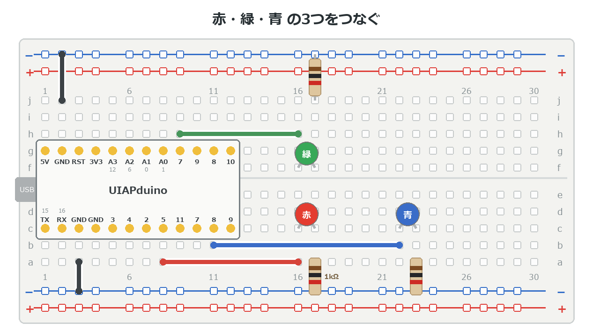
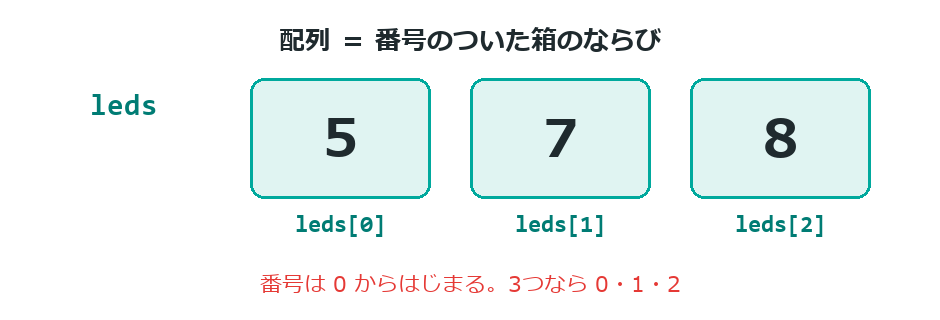
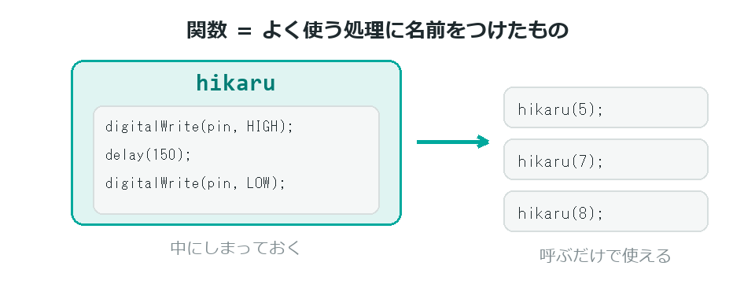

{cover}
# ④ 配列と関数でまとめよう

ばらばらの命令をまとめる

*UIAPduino 体験ワークショップ*

---

# なにをするの？
制御編の仕上げ。プログラムを**すっきりさせる道具**を2つおぼえるよ。

- **配列** … たくさんの数を1つの名前でまとめる
- **関数** … よく使う処理に名前をつける

> どちらも「**同じことを何度も書かない**」ための道具だよ。

---

# LEDを3つつなごう

:::

**USBケーブルを抜いてから**つなごう。

1. **赤・緑・青**のLEDをブレッドボードにさす
2. それぞれに **1kΩ** の抵抗をつける
3. 赤を **5番**、緑を **7番**、青を **8番**につなぐ
4. 抵抗のもう一方はすべて **GND** へ

> ⚠ LED 1つにつき抵抗1つ。**まとめて1つ**ではダメだよ。

:::



---

# 配列＝番号つきの箱

:::

3つのピン番号を、1つの名前でまとめられるよ。

- `leds[0]` … 5
- `leds[1]` … 7
- `leds[2]` … 8

> ⚠ 番号は **0 から**はじまる。1からじゃないので気をつけて。
> 3つあれば `0` `1` `2` だよ。

:::
```cpp
const int leds[] = {5, 7, 8};   // 赤・緑・青
```


---

# for と組み合わせる

:::

配列は `for` と組み合わせると力を発揮するよ。

`i` が 0→1→2 と変わるので、`leds[i]` は **5→7→8** と変わる。
3つぶんの命令が、**3行で書ける**んだ。

> LEDが10個になっても、変えるのは配列の中身と `3` の数字だけ。

:::
```cpp
for (int i = 0; i < 3; i++) {
  digitalWrite(leds[i], HIGH);
}
```
![i が 0→1→2 と変わると、leds[i] は 5→7→8 になる](image/index/array_for.png)

---

# 関数＝処理につける名前

:::

よく使う処理に名前をつけておくと、何度でも呼び出せるよ。

こう書いておけば、あとは `hikaru(5);` と書くだけで光る。

> `setup()` や `loop()` も、じつは関数のなかまなんだ。

:::
```cpp
void hikaru(int pin) {
  digitalWrite(pin, HIGH);
  delay(150);
  digitalWrite(pin, LOW);
}
```


---

# プログラムを書きこもう

:::

配列と関数を両方つかうよ。

1. 右のプログラムを書きこむ
2. 3つのLEDが**順番に流れるように**光る
3. `delay(150)` を変えると、流れる速さが変わる

> `loop()` の中がたった1行になった。中身は関数と配列にしまってある。

> くりかえす中身が**1つだけ**なら、`{ }` は省略できるよ。

:::

```cpp `c4_nagare` 3つのLEDが流れる
const int leds[] = {5, 7, 8};   // 赤・緑・青

void hikaru(int pin) {        // 1つ光らせる
  digitalWrite(pin, HIGH);
  delay(150);
  digitalWrite(pin, LOW);
}

void setup() {
  for (int i = 0; i < 3; i++) pinMode(leds[i], OUTPUT);
}

void loop() {
  for (int i = 0; i < 3; i++) hikaru(leds[i]);
}
```

---

# 💪 やってみよう

まとめる力を試してみよう。

1. 配列の順番を `{8, 7, 5}` にすると、流れる向きはどうなる？
2. `hikaru()` の `delay(150)` を変えて、速さを調整する
3. 行って帰ってくる（5→7→8→7→5）ようにしてみる

> 💪 LEDを**4つ以上**に増やしてみよう。
> 配列に足して、`3` の数字を変えるだけでいいはずだよ。

> 💪 これで制御編は修了！ 次の**発展編**では、
> センサーで感じて、モーターで動かす作品づくりに進むよ。
