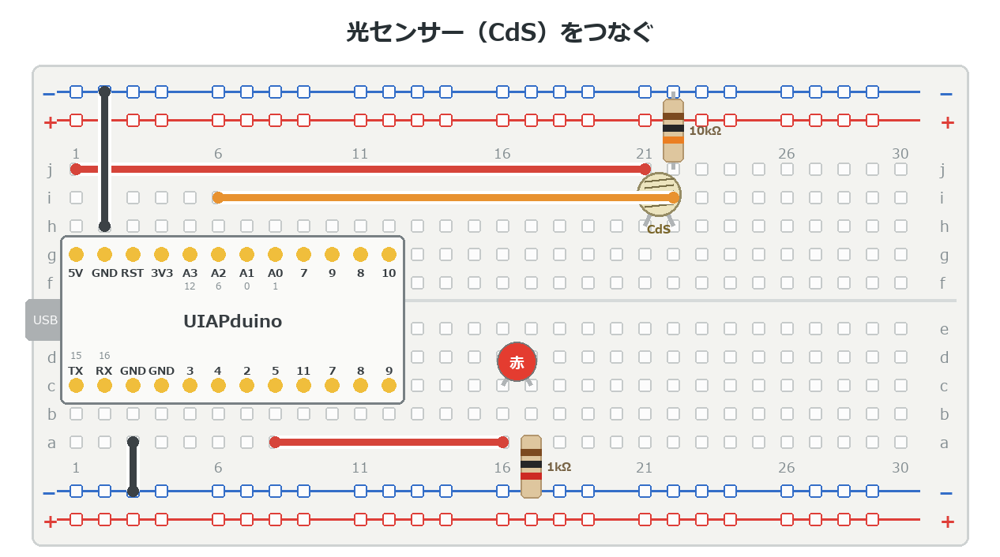

{cover}
# ① 光センサーで暗くなったら光る

くらさを感じて自動で光る

*UIAPduino 体験ワークショップ*

---

# なにをするの？

:::

いよいよ**センサー**の登場だよ。

- **CdS**（光センサー）で明るさをはかる
- 暗くなったら、自動でLEDが光る
- 使うのは `analogRead` と `if`。**どちらももう習った**

> つまみをセンサーに置きかえるだけ。c3 の続きなんだ。

:::

> 📷 手でセンサーをおおうとLEDが光る写真（2枚：明るいとき・おおったとき）

---

# CdS ってなに？

**明るさによって、電気の通しやすさが変わる**部品だよ。

- 明るい … 電気を通しやすい（抵抗が小さい）
- 暗い … 電気を通しにくい（抵抗が大きい）

向きはないので、どちら向きでもOK。

> 表面のうねうねした模様が、光を受けるところ。指でさわらないようにね。

---

# 抵抗と組にして使う

:::

CdS だけでは電圧にならないので、**もう1つ抵抗と組にする**よ。

1. **5V** ── CdS ── **A2** ── 10kΩ ── **GND** の順につなぐ
2. まん中（CdS と 10kΩ のあいだ）が **A2**

これで、明るさが**電圧の高さ**に変わる。b4 のつまみと同じ形だね。

> ⚠ 10kΩ は「茶・黒・だいだい」。1kΩ（茶・黒・赤）とまちがえないように。

:::



---

# まず値を見てみよう

:::

しきい値を決める前に、**どのくらいの値になるか**を確かめよう。

1. 右のプログラムを書きこむ（b4 と同じ）
2. センサーを手でおおって、変わりかたを見る

> このつなぎ方だと **明るいほど値が大きい**。
> 逆になったら、CdS と 10kΩ を入れかえているかも。

:::

```cpp `e1_check` まず明るさを見る
const int CDS = A2;
const int LED = 5;

void setup() {
  pinMode(LED, OUTPUT);
  analogWriteResolution(8);
}

void loop() {
  analogWrite(LED, analogRead(CDS) / 4);
  delay(10);
}
```

---

# 自動ライトにしよう

:::

しきい値をこえたら光る、というプログラムに変えるよ。

1. 右のプログラムを書きこむ
2. センサーを手でおおうと、LEDが光る
3. `300` を変えて、**ちょうどいいさかいめ**をさがす

> ⚠ 光らないときは `<` を `>` に変えてみよう。
> つなぎ方によって、大きい・小さいが逆になるんだ。

:::

```cpp `e1_light` 暗くなったら光る
const int CDS = A2;
const int LED = 5;

void setup() {
  pinMode(LED, OUTPUT);
}

void loop() {
  if (analogRead(CDS) < 300) {
    digitalWrite(LED, HIGH);   // 暗い → 光る
  } else {
    digitalWrite(LED, LOW);
  }
  delay(50);
}
```

---

# 💪 やってみよう

しきい値と動きを工夫してみよう。

1. 明るさに応じて、**だんだん明るくなる**ようにする（`analogWrite`）
2. 暗くなったら**音も鳴る**ようにする（b5 のブザー）
3. `else if` で3段階に分ける（明るい・ふつう・暗い）

> 💪 街灯のように「**暗くなってすぐには消えない**」ようにできるかな。
> 明るくなっても数秒待ってから消す、という工夫だよ。

> この章でできたことが、そのまま**作品のたね**になるよ。
