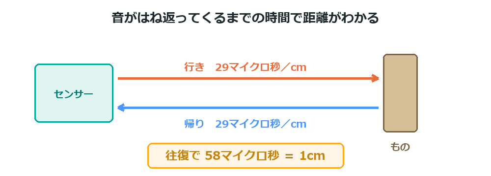

{cover}
# ③ ものとの距離をはかろう

音のはね返りで距離をはかる

*UIAPduino 体験ワークショップ*

---

# なにをするの？

:::

こうもりと同じやり方で、**ものまでの距離**をはかるよ。

- 超音波（人には聞こえない音）を出す
- **はね返ってくるまでの時間**をはかる
- 時間から距離を計算する

> 音の速さは1秒に約340m。この章は**理科と算数がつながる**回だよ。

:::

> 📷 手を近づけるとLEDが光る写真（近いとき・遠いとき）

---

# HC-SR04 のしくみ

:::

目玉のような**2つの筒**がついているね。役割がちがうんだ。

- 片方が**スピーカー**（音を出す）
- もう片方が**マイク**（はね返りを聞く）

足は4本。**VCC・TRIG・ECHO・GND** だよ。

> `TRIG` は「引き金」。ここに合図を送ると、音を出してくれる。

:::

> 📷 HC-SR04 の4本の足を大きく写した写真

---

# つなごう

:::

**USBケーブルを抜いてから**つなごう。

1. **VCC** を **5V** につなぐ（このセンサーは5Vで動く）
2. **GND** を **GND** につなぐ
3. **TRIG** を **5番ピン**につなぐ
4. **ECHO** を **7番ピン**につなぐ

> ⚠ **ECHO は必ず7番**に。ほかのピンだとボードを傷める可能性があるよ。

:::

> 📷 HC-SR04 の配線を真上から撮った写真（ピン名を書きこむ）

---

# 時間から距離へ

:::

音は1秒に約 **340m**、つまり **1cm を約29マイクロ秒**で進む。

はね返りは**往復**するから、1cm あたり **58マイクロ秒**かかる計算だね。

> つまり「**58マイクロ秒 ＝ 1cm**」。
> だから 58マイクロ秒ずつ数えていけば、その回数がそのまま cm になる。

:::



---

# 数えて距離をはかる

:::

`ECHO` が HIGH のあいだ、**少しずつ待ちながら回数を数える**よ。

1. `TRIG` に合図を送る
2. `ECHO` が HIGH になるのを待つ
3. HIGH のあいだ、50マイクロ秒ずつ数える
4. 数えた回数が、ほぼ **cm**

> `- 2` は、センサーが返事をするまでのぶんを引いているんだ。

:::

```cpp `e3_kyori` きょりをはかる
int kyori() {                    // きょりを cm ではかる
  digitalWrite(TRIG, HIGH); delayMicroseconds(10); digitalWrite(TRIG, LOW);
  int w = 0;
  while (digitalRead(ECHO) == LOW) { if (++w > 600) return 999; }
  int n = 0;
  while (digitalRead(ECHO) == HIGH && n < 600) {
    delayMicroseconds(50);       // 音が 1cm 往復する時間
    n++;
  }
  return n - 2;                  // 数えた回数 ＝ ほぼ cm
}
```

---

# 近づいたら光らせよう

:::

`kyori()` を作っておけば、使うのはかんたんだよ。

1. 右のプログラムを、さっきの `kyori()` のあとに書く
2. 20cm より近づくとLEDが光る
3. 定規で測って、**合っているか確かめる**

> `999` がかえってきたら「反応なし」。
> センサーがつながっていないときや、遠すぎるときだよ。

:::

```cpp `e3_kyori` につづけて書く
const int TRIG = 5;
const int ECHO = 7;
const int LED  = 8;

void setup() {
  pinMode(TRIG, OUTPUT);
  pinMode(ECHO, INPUT);
  pinMode(LED, OUTPUT);
}

void loop() {
  digitalWrite(LED, kyori() < 20 ? HIGH : LOW);
  delay(100);
}
```

---

# 💪 やってみよう

距離を使って、いろいろな反応をさせてみよう。

1. しきい値を **10cm・50cm** に変えて、反応を見る
2. 近いほど**速く点滅**するようにする
3. 近いほど**高い音**が鳴るようにする（b5 のブザー）

> 💪 車のバックセンサーみたいに、
> 近づくほど「ピピピ…」が速くなるようにしてみよう。

> 💪 次の章のサーボと組み合わせると、
> 「**近づくと動く**」しかけが作れるよ。
