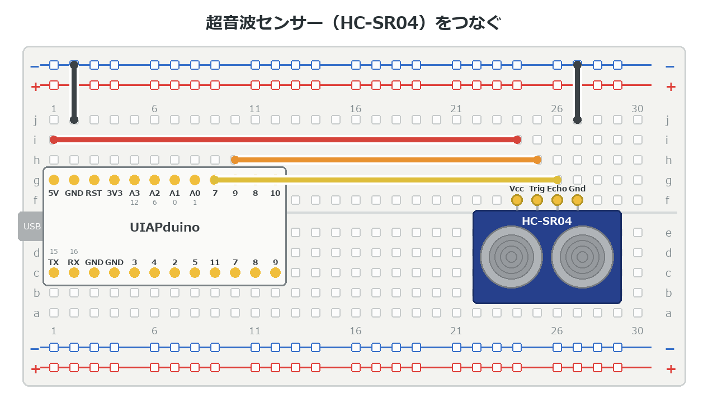

{cover}
# ③ ものとの距離をはかろう

音のはね返りで距離をはかる

*UIAPduino 体験ワークショップ*

---

# なにをするの？

:::

こうもりと同じやり方で、**ものまでの距離**をはかるよ。

- 超音波（人には聞こえない音）を出す
- **はね返ってくるまでの時間**をはかる
- 時間から距離を計算する

> 音の速さは1秒に約340m。この章は**理科と算数がつながる**回だよ。

:::

> 📷 手を近づけるとLEDが光る写真（近いとき・遠いとき）

---

# HC-SR04 のしくみ

目玉のような**2つの筒**がついているね。役割がちがうんだ。

- 片方が**スピーカー**（音を出す）
- もう片方が**マイク**（はね返りを聞く）
- はかれるのは **2cm 〜 4m**。**正面から15度**くらいの範囲

足は4本。上から見ると左から **Gnd・Echo・Trig・Vcc** だよ。

> `Trig` は「引き金」。ここに合図を送ると、音を出してくれる。

>| ⚠ **2cm より近い**と はかれない。ぴったりくっつけても数字は出ないよ。

---

# つなごう

:::

**USBを抜いてから**つなごう。

1. センサーは **j行の 18〜21列**
2. ピンは左から **Gnd・Echo・Trig・Vcc**
3. **Echo**→**7番** ／ **Trig**→**9番**
4. **Vcc**→**＋レール** ／ **Gnd**→**−レール**
5. LEDは **16・17列**（5番から）

> ⚠ ピンの名前は**部品の裏**に書いてある。
> 上から見ると、左右が逆に見えるので気をつけて。

:::



---

# 時間から距離へ

:::

音は1秒に約 **340m**、つまり **1cm を約29マイクロ秒**で進む。

はね返りは**往復**するから、1cm あたり **58マイクロ秒**かかる計算だね。

> つまり「**58マイクロ秒 ＝ 1cm**」。
> だから この時間ずつ数えていけば、その回数がそのまま cm になる。

:::


---

# 数えて距離をはかる

:::

`ECHO` が HIGH のあいだ、**少しずつ待ちながら回数を数える**よ。

1. `TRIG` に合図を送る
2. `ECHO` が HIGH になるのを待つ
3. HIGH のあいだ **50**マイクロ秒ずつ数える（測って合わせた数）
4. 数えた回数が、ほぼ **cm**

> `- 2` は、センサーが返事をするまでのぶんを引いているんだ。

:::

```cpp `e3_kyori` きょりをはかる
const int TRIG = 9;
const int ECHO = 7;
const int LED  = 5;

int kyori() {                    // きょりを cm ではかる
  digitalWrite(TRIG, HIGH); delayMicroseconds(10); digitalWrite(TRIG, LOW);
  int w = 0;
  while (digitalRead(ECHO) == LOW) { if (++w > 600) return 999; }
  int n = 0;
  while (digitalRead(ECHO) == HIGH && n < 600) {
    delayMicroseconds(50);       // 実測で 1回 ＝ 1cm
    n++;
  }
  return n - 2;                  // 数えた回数 ＝ ほぼ cm
}
```

---

# 数で読んでみよう

:::

`kyori()` が返すのは **cm**。**10 でわった 0〜10** の
回数だけ光らせて、距離を数字で読むよ。

1. 右のプログラムを `kyori()` のあとに書く
2. LEDの**点滅の回数 × 10** が距離（cm）

> **30cm** なら **3回**。定規で測って確かめよう。

:::

```cpp `e3_kyori` につづけて書く
void setup() {
  pinMode(TRIG, OUTPUT);
  pinMode(ECHO, INPUT);
  pinMode(LED, OUTPUT);
}

void loop() {
  int n = kyori() / 10;
  if (n > 10) n = 10;   // 反応なしのとき用
  for (int i = 0; i < n; i++) {
    digitalWrite(LED, HIGH); delay(200);
    digitalWrite(LED, LOW);  delay(300);
  }
  delay(2000);
}
```

---

# 近づいたら光らせよう

:::

こんどは **20cm より近づいたら光る**ようにするよ。

1. `loop()` の中を、右のように書きかえる
2. 手を近づけたり はなしたりする
3. 20cm のさかいめで**パッと**切りかわる

> `999` がかえってきたら「反応なし」。
> センサーがつながっていないときや、遠すぎるときだよ。

:::

```cpp `e3_kyori` の loop() を書きかえる
void loop() {
  digitalWrite(LED, kyori() < 20 ? HIGH : LOW);
  delay(100);
}
```

---

# 💪 やってみよう

距離を使って、いろいろな反応をさせてみよう。

1. しきい値を **10cm・50cm** に変えて、反応を見る
2. 近いほど**速く点滅**するようにする
3. **3色で知らせる** … 緑を **8番**、青を **10番**に足して、30cmで緑、20cmで緑＋青、10cmで緑＋青＋赤（5番）

>| 💪 次の章のサーボと組み合わせると、
> 「**近づくと動く**」しかけが作れるよ。
