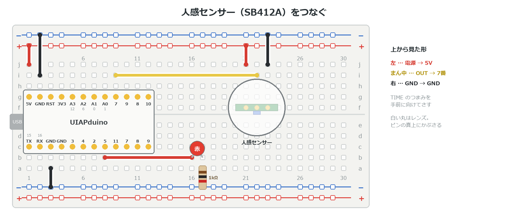

{cover}
# ④ 人感センサーで人を見つけよう

人が来たら知らせる

*UIAPduino 体験ワークショップ*

---

# なにをするの？

:::

**人感センサー**は、人の**熱の動き**を見つけるセンサーだよ。

- 玄関やトイレの**自動ライト**に使われている
- 人を見つけると、合図が**数秒間 HIGH** になる
- 線は **3本**だけ

> 使うのは **SB412A** という小さなセンサーだよ。

:::

> 📷 SB412A。白いレンズ・3本のピン・TIME のつまみ

---

# センサーのしくみ

- 合図は **HIGH か LOW** だけ（`digitalRead` で読める）
- 人が動くと **HIGH**。そのあと **2〜4秒** は HIGH のまま
- 動きつづけると、HIGH の時間が**のびる**
- LOW にもどったあと **2.3秒** は、反応しない
- 見えるのは **5m くらい先まで、115°** の広さ

> ⚠ 見ているのは**熱の動き**。じっとしている人や、ガラスの向こうの人は見つけられないよ。

---

# 3V でも HIGH と読める

センサーの HIGH は **3V**。ボードは 5V で動いているけど、だいじょうぶ。

- このボードは、だいたい **2V より上**を HIGH と読む
- 3V は、それより十分に高い

> センサーの中には 3V の回路があって、合図はそこから出ている。
> だから電源を 5V にしても、HIGH は 3V のままなんだ。

---

# つなごう

:::

**USBケーブルを抜いてから**つなごう。

1. ボードの **5V**→＋レール ／ **GND**→−レール
2. **TIME のつまみを手前**にして、f 行に立ててさす
3. 左から **電源**→＋ ／ **OUT**→**7番** ／ **GND**→−
4. LED は e3 と同じ（**5番**）

> ⚠ 電源は **5V**。3V3 では足りないよ。（**要確認**：ピンの向き）

:::



---

# 人が来たら光らせよう

:::

センサーの合図を、そのまま LED に映すよ。

1. 右のプログラムを書きこむ
2. センサーの前で**手を動かす**
3. LED が光って、数秒で消える

> ⚠ `INPUT_PULLUP` にしない。センサーが自分で HIGH・LOW を出しているよ。

:::

```cpp `e4_motion` 合図をそのまま LED に
const int PIR = 7;   // 人感センサーの OUT
const int LED = 5;

void setup() {
  pinMode(PIR, INPUT);
  pinMode(LED, OUTPUT);
}

void loop() {
  digitalWrite(LED, digitalRead(PIR));
}
```

---

# ⚠ うまく反応しないとき

- **電源を入れた直後**は、しばらく勝手に反応することがある（⚠ **要確認**：何秒か実機で測る）
- **エアコンやヒーターの風**、**日光**が当たる場所は苦手
- **ゆらす・たたく**と反応してしまう。机に置いて使おう
- 反応しっぱなし・まったく反応しない → 3本の線と、ピンの向きを確かめる

> センサーの説明書にも、この苦手な場所が書いてあるよ。

---

# 自動ライトにしよう

:::

人が来たら、**10秒** 光りつづけるようにするよ。

1. 右のプログラムを書きこむ
2. センサーの前を通る
3. 10秒たつと消える

> `if` で「HIGH なら光らせて10秒待つ」。c3 の形だね。

:::

```cpp `e4_motion` の loop() を書きかえる
void loop() {
  if (digitalRead(PIR) == HIGH) {
    digitalWrite(LED, HIGH);
    delay(10000);            // 10秒 光りつづける
  } else {
    digitalWrite(LED, LOW);
  }
}
```

---

# 💪 やってみよう

人を見つけたら、いろいろな知らせ方をしてみよう。

1. 光る時間を **3秒・30秒** に変える
2. 人が来たら**ブザー**で知らせる（b5）
3. 来た人の**回数を数えて**、LED の点滅回数で知らせる（c1 の変数）
4. 光センサー（e1）と組み合わせて、**暗いときだけ**光らせる

>| 💪 次の章のサーボと組み合わせると、
> 「**人が来たら旗をふる**」しかけが作れるよ。
