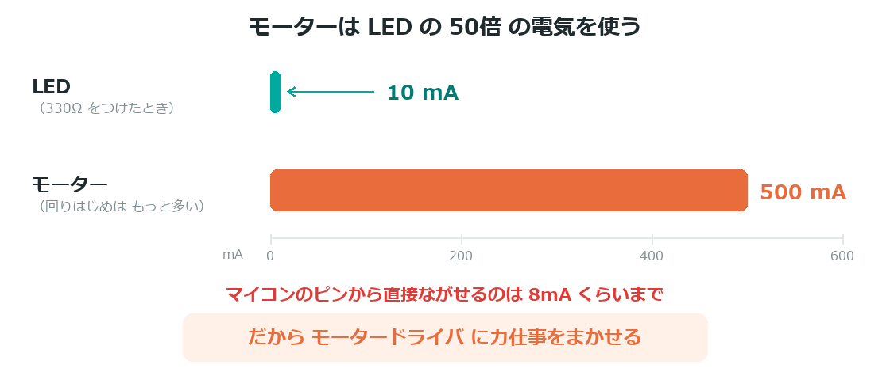
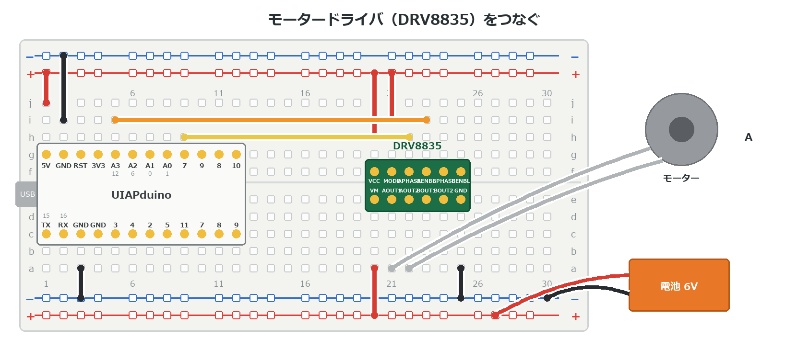
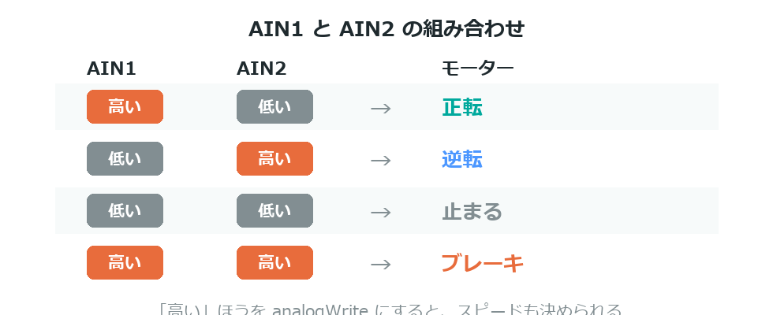

{cover}
# ⑤ モータードライバでDCモーター

回す・逆に回す・速さを変える

*UIAPduino 体験ワークショップ*

---

# なにをするの？

:::

いよいよ**ぐるぐる回るモーター**を動かすよ。

- なぜ**モータードライバ**が必要なのか
- 正転・逆転・停止のしくみ
- PWM で**スピードを変える**

> ここまでで作った「感じるしかけ」と組み合わせると、**動く作品**になるよ。

:::

> 📷 モーターが回っている写真（正転・逆転）

---

# ⚠ 直接つないではいけない

:::

モーターは、LEDとくらべて**けたちがいに電気を使う**。

- LED … 3ミリアンペアくらい
- モーター … **数百ミリアンペア〜1アンペア**

ピンから直接流せる電気では**まったく足りない**し、
無理に流すと**マイコンがこわれる**。

> だから「**モータードライバ**」という部品にお願いするんだ。

:::



---

# モータードライバの役目

使うのは **DRV8835** というモータードライバだよ。

- マイコンからの**小さな合図**を受けとる
- **べつの電源**から、モーターに大きな電気を流す
- 合図しだいで、流す**向きも変えられる**

> 「マイコンは指示を出すだけ、力仕事はドライバがやる」という分担だね。

---

# つなごう（合図の線）

:::

**USBケーブルを抜いてから**つなごう。まず合図の線から。

1. **VCC** → **5V** ／ **GND** → **GND**
2. **MODE** → **GND**
3. **AIN1** → **12番**（A3）／ **AIN2** → **0番**（A1）

> ⚠ VCC は **3V3 ではなく 5V**。端子名は基板の印刷で確かめてね。

:::



---

# つなごう（力の線）

つぎに、モーターと電池をつなぐよ。

1. **AO1・AO2** にモーターの2本の線をつなぐ（向きはどちらでもOK）
2. **VM** に電池の＋をつなぐ（**2〜11V**。単3電池4本＝6Vなど）
3. 電池の−を **GND** につなぐ

> ⚠ 電池の−とボードの GND は、**かならずつなぐ**。
> ここがつながっていないと、合図が伝わらず動かないよ。

---

# 2本の線で向きが決まる

:::

`AIN1` と `AIN2` の組み合わせで、モーターの動きが決まるよ。

- `AIN1`＝高い、`AIN2`＝低い → **正転**
- `AIN1`＝低い、`AIN2`＝高い → **逆転**
- 両方とも低い → **止まる**（そのまま惰性で回る）
- 両方とも高い → **ブレーキ**

> 高いほうを `analogWrite` にすると、**スピードも決められる**んだ。

:::



---

# プログラムを書きこもう

:::

正転・逆転・停止をくりかえすよ。

1. 右のプログラムを書きこむ
2. 2秒ずつ、正転 → 逆転 → 停止
3. `200` を変えると、スピードが変わる

> **どちらも PWM が使えるピン**を選んである。
> だから正転でも逆転でもスピードを変えられるんだ。

:::

```cpp `e5_motor` 正転と逆転をくりかえす
const int AIN1 = 12;  // どちらも PWM が使えるピン
const int AIN2 = 0;

void setup() {
  pinMode(AIN1, OUTPUT);
  pinMode(AIN2, OUTPUT);
  analogWriteResolution(8);
}

void loop() {
  analogWrite(AIN1, 200);  digitalWrite(AIN2, LOW);   // 正転
  delay(2000);
  digitalWrite(AIN1, LOW); analogWrite(AIN2, 200);    // 逆転
  delay(2000);
  digitalWrite(AIN1, LOW); digitalWrite(AIN2, LOW);   // 停止
  delay(1000);
}
```

---

# 💪 やってみよう

スピードと向きを自由にあやつってみよう。

1. `200` を **80・255** に変えて、速さのちがいを見る
2. `for` を使って、だんだん速く・だんだん遅くする
3. つまみ（b4）でスピードを決められるようにする

> ⚠ 数字を小さくしすぎると、**うなるだけで回らない**ことがある。
> 回りはじめる最低の数字をさがしてみよう。

> 💪 モーターを**2つ**つないで（`BIN1`・`BIN2`）、
> 左右の車輪みたいに動かすと**ロボットカー**になるよ。

> 📷 2つのモーターをつないだ発展例

> 💪 これで発展編は修了！ 次の**作品編**では、
> 自分で考えた作品を、思いつきから発表までやりきるよ。
