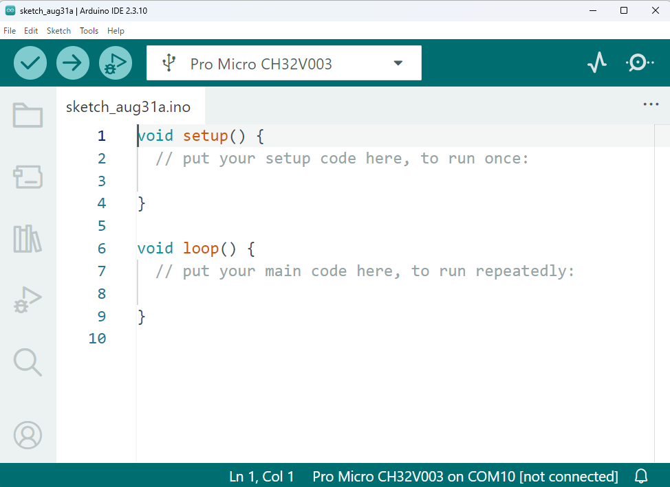
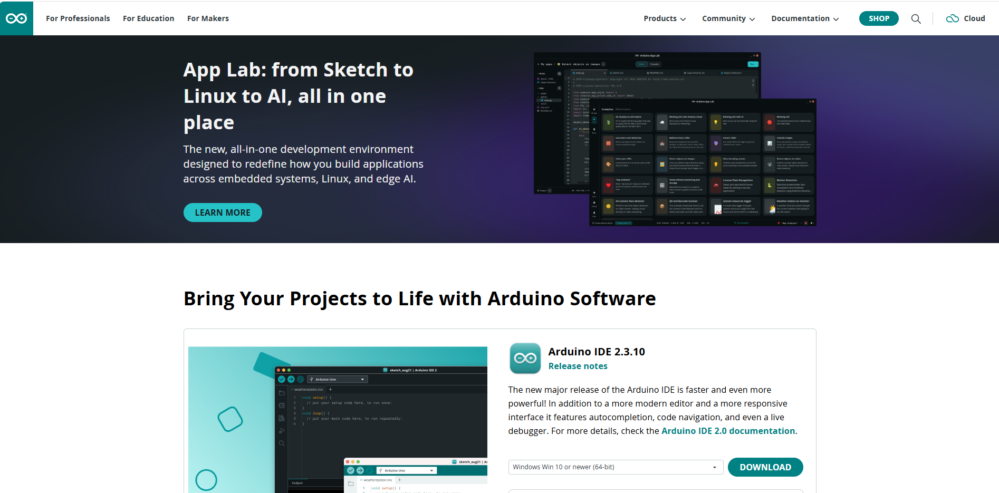
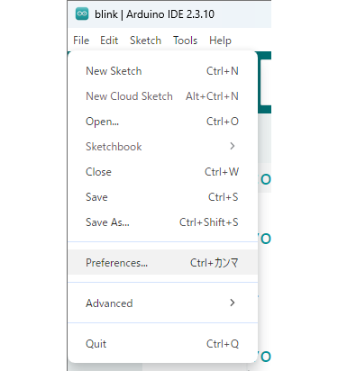
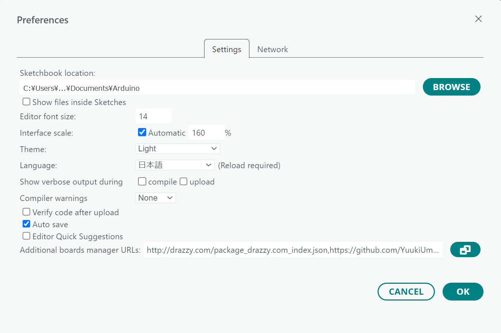
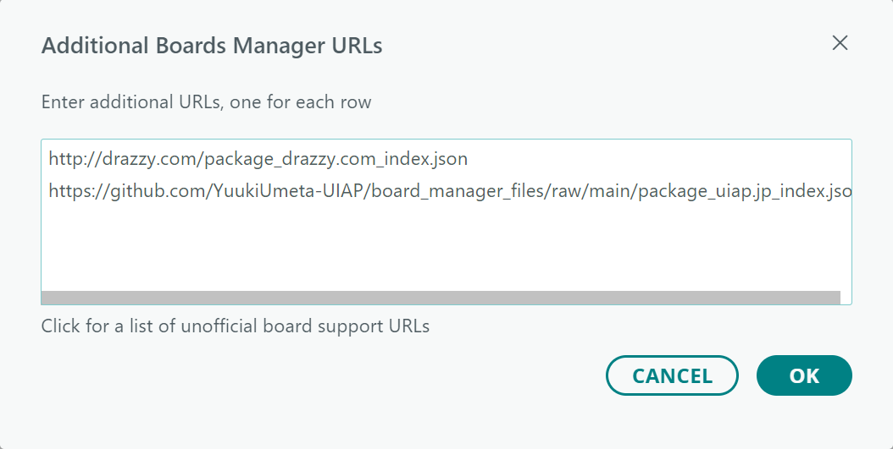
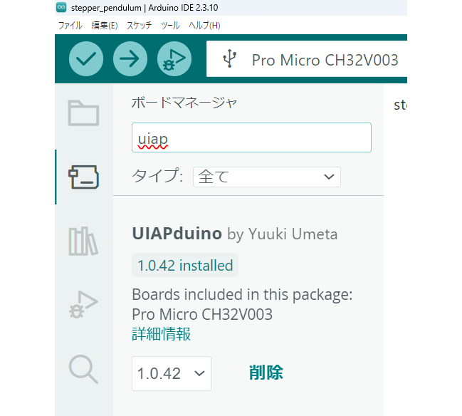
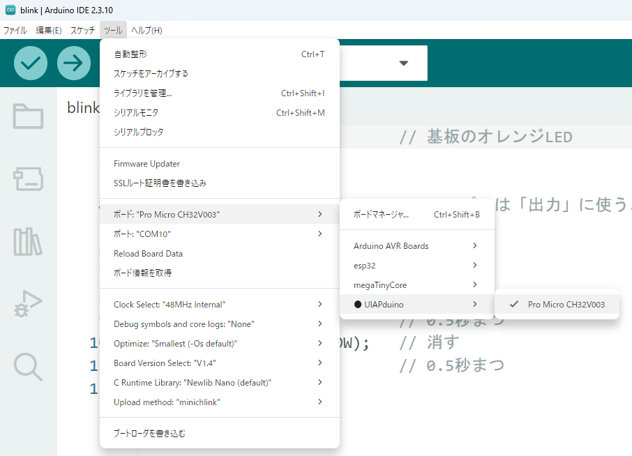
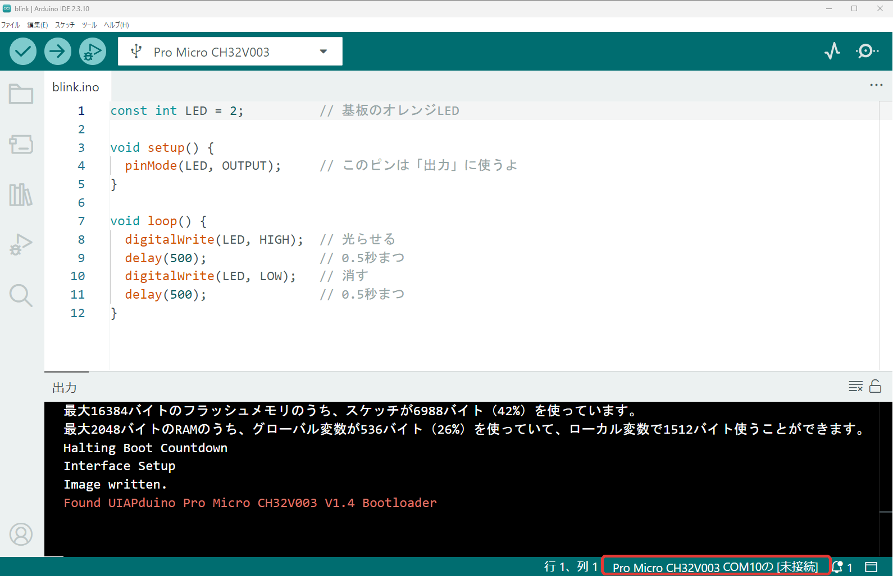

{cover}
# ② Arduino IDE をじゅんびしよう

プログラムを作る道具をそろえる

*UIAPduino 体験ワークショップ*

---

# なにをするの？

:::

プログラムを書く道具、**Arduino IDE** をじゅんびするよ。

1. IDE を**インストール**する
2. メニューを**日本語**にする
3. UIAPduino を**追加**する
4. 使うボードを**えらぶ**

> ⚠ じゅんびは**さいしょの1回だけ**。
> 次からはすぐ書けるよ。

:::



---

# 手順①：Arduino IDE を入れる

:::

教室のパソコンには**もう入っている**かも。

1. ブラウザで**右のURL**をひらく
2. ページを**下にスクロール**する
3. 「**Arduino IDE**」をさがす
4. 自分のPCに合うものを **DOWNLOAD**

> ⚠ 上の「**App Lab**」はべつのソフト。
> 寄付の画面は **JUST DOWNLOAD** で進める。

:::

```
https://www.arduino.cc/en/software/
```



---

# 手順②：日本語にしよう

:::

まずメニューを**日本語**にするよ。

1. **ファイル**（File）をクリック
2. **基本設定**（Preferences）
3. **言語** を **日本語** にする

> ⚠ この画面は**手順③でも使う**。
> **OK はまだ押さない**でね。

:::




---

# 手順③：ボードのURLを貼りつける

:::

IDE に「**こういうボードがあるよ**」と教えよう。

1. 「追加のボードマネージャのURL」の
   **右の小さなボタン**をクリック
2. 右のURLを「📋 コピー」する
3. **あいている行**に貼りつける
4. **OK** → もう一度 **OK**

> ⚠ すでにURLがあれば**あたらしい行**へ。

:::

```
https://github.com/YuukiUmeta-UIAP/board_manager_files/raw/main/package_uiap.jp_index.json
```



---

# 手順④：UIAPduino を入れる

:::

1. 左のアイコンから**ボードマネージャ**をひらく
2. 検索らんに **`uiap`** と入力する
3. **UIAPduino** の **インストール** を押す
4. 終わるまで待つ

> ボタンが「**削除**」に変われば成功！ 🎉
> `Pro Micro CH32V003` の文字も確かめよう。

:::



---

# 手順⑤：ボードをえらぶ

:::

どのボードを使うのか、IDE に教えよう。

1. 上のメニューの **ツール**
2. **ボード** → **UIAPduino**
3. **Pro Micro CH32V003** をクリック

> 画面の下に `Pro Micro CH32V003` と出れば成功！ 🎉
> ⚠ **Board Version Select** が `V1.4` かも確かめて。

:::



---

# ⚠ ポートは選ばなくていい

:::

本には「ポートをえらぶ」と書いてあるけど、
**このボードでは選ばなくていい**んだ。

- 通信にシリアルポートを**使わない**
- 下のバーはいつも「**未接続**」
- `COM10` などが出ても**気にしない**

> ⚠ 「未接続」でも**こわれていない**よ。

:::



---

# うまくいかないときは

:::

- **インストールでエラーが出る**
  → URLが正しく貼れているか確かめる
- **「実行できません」と出る**
  → Visual C++ 再頒布可能パッケージを入れる
- **UIAPduino が出てこない**
  → IDE を閉じて開きなおす

> こまったら**メンターをよんでね**。
> 💪 次はいよいよ書きこみだ！

:::


