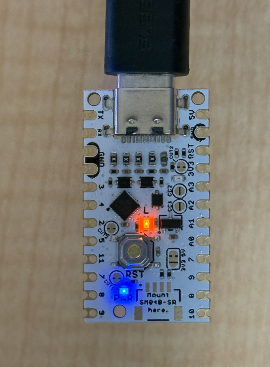
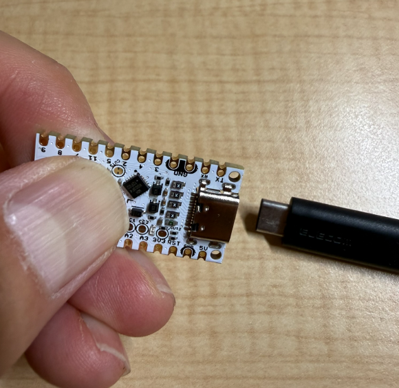
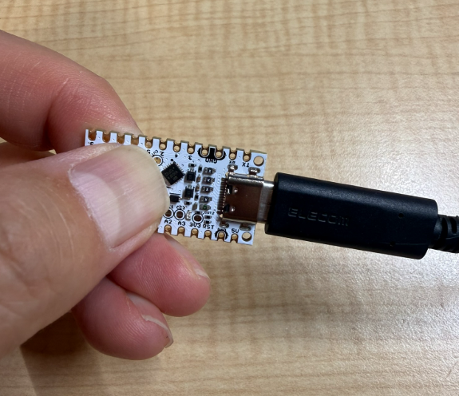
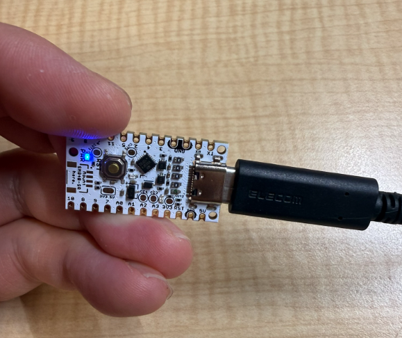
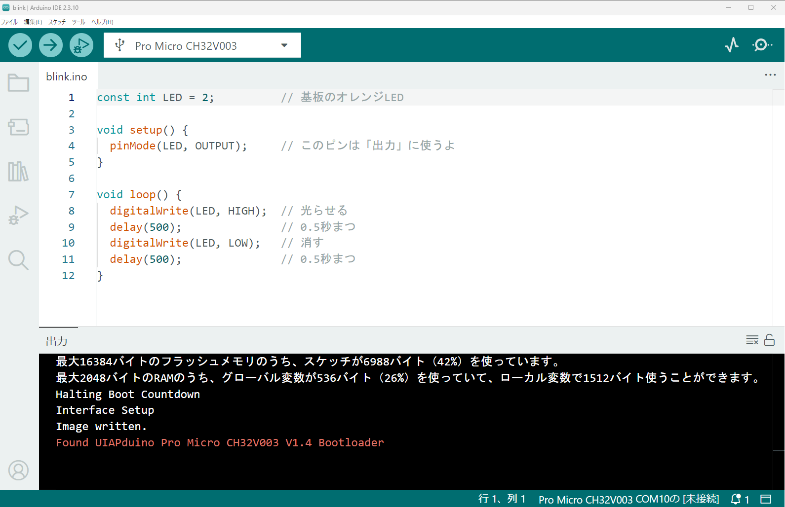
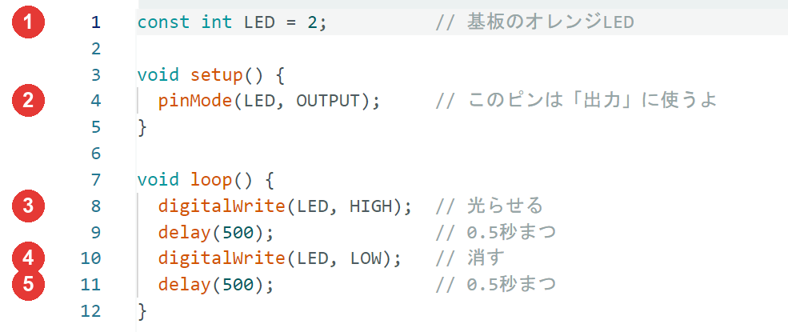

{cover}
# ③ はじめてのLチカ

はじめてのプログラムを書きこもう

*UIAPduino 体験ワークショップ*

---

# なにをするの？

:::

基板の**オレンジのLED**をチカチカ光らせるよ。

これは **Lチカ**。マイコン使いが**最初にやること**なんだ。

- プログラムの**形**をおぼえる
- **書きこみ方**をおぼえる
- 光る速さを**自分で変える**

> ここができれば、あとはぜんぶ応用だよ！

:::



---

# プログラムの形をおぼえよう

:::

Arduino のプログラムは、**2つの部屋**でできているよ。

- `setup()` … **さいしょに1回だけ**
- `loop()` … **ずっとくりかえし**

> 電源を入れると `setup()` を1回。
> そのあと `loop()` をずっとくりかえすんだ。

:::

```cpp プログラムの形
void setup() {
  // さいしょに1回だけ
}

void loop() {
  // ずっとくりかえし
}
```

---

# 手順①：新しいスケッチを作る

:::

Arduino ではプログラムを **スケッチ** とよぶよ。

1. **ファイル** → **新規スケッチ**
2. `setup()` と `loop()` が書いてある
3. **ファイル** → **名前を付けて保存**

> 中の英語の文は**メモ書き**。消してOKだよ。

> 名前は、プログラムの上に書いてあるもの（`i3_blink`）を使おう。

:::


---

# 手順②：プログラムを入力しよう

:::

右のプログラムを入力しよう。**📋 コピー**も使えるよ。

1. 元から書いてあるものを**ぜんぶ消す**
2. 右のプログラムを貼りつける
3. `Ctrl` + `T` で**字下げがそろう**

> ⚠ `;` と `{ }` を忘れやすいよ。コピーを使うと安心。

:::

```cpp `i3_blink` はじめてのLチカ
const int LED = 2;          // 基板のオレンジLED

void setup() {
  pinMode(LED, OUTPUT);     // このピンは「出力」に使うよ
}

void loop() {
  digitalWrite(LED, HIGH);  // 光らせる
  delay(500);               // 0.5秒まつ
  digitalWrite(LED, LOW);   // 消す
  delay(500);               // 0.5秒まつ
}
```

---

# 手順③：書きこんで、動かそう ★いちばん大事

:::

USBを抜くところから、**一気に**やるよ。

1. USBケーブルを**抜く**
2. **RESETを押しながら**USBを挿す
3. **すぐ RESET をはなす**（青いLED）
4. **→** を押して `Image written.` を待つ
5. **RESETをもう1回** → 大成功！ 🎉

> ⚠ 1〜3 は「**押す → 挿す → はなす**」。
> だめでも **1 からやりなおせばOK**。何回でも。

:::







---

# ⚠ こんなエラーが出たら

:::

赤い字で **`Could not initialize`** と出たら、
**書きこみモードになっていない**サインだよ。

**RESETを押しながら挿す**のを忘れただけ。こわれてないよ。

なおし方は**手順③の 1 からやりなおす**だけ。

> ダメなときはメンターをよんでね。

:::


---

# プログラムを読んでみよう

:::

右のコードを、①から順に見てみよう。

1. `const int LED = 2` … 2番ピンに**名前**をつける
2. `pinMode` … このピンを**出力**にする
3. `digitalWrite(HIGH)` … **光る**
4. `digitalWrite(LOW)` … **消える**
5. `delay(500)` … **0.5秒まつ**

> `//` の右は**メモ書き**。動きには関係しないよ。

:::



---

# ⚠ このボードの、ちょっと変わったところ

Arduino の本やネットの記事には、よく **シリアルモニタ** というものが出てくる。
プログラムの中の数字をパソコンの画面に表示するしくみだよ。

でも **UIAPduino では、シリアルモニタは使えない**んだ。

- `Serial.print` を書いても、画面には出てこない
- そのかわり、このワークショップでは**LEDの明るさや点滅の回数**で数字を見えるようにするよ

> こまったときのたしかめ方は「**LEDを光らせてみる**」。これがこのボードの合言葉。

---

# 💪 やってみよう

プログラムの数字を変えて、動きがどう変わるか見てみよう。

1. `delay(500)` の **500 を 100** にして書きこむ → どうなる？
2. **500 を 2000** にして書きこむ → どうなる？
3. 光っている時間と消えている時間を、**べつべつの数**にしてみよう

> 💪 **SOS** を光で送ってみよう。
> トン・トン・トン（短く3回）→ ツー・ツー・ツー（長く3回）→ トン・トン・トン

> 変えるたびに、**手順③の書きこみモードから**やりなおすのを忘れずに。
