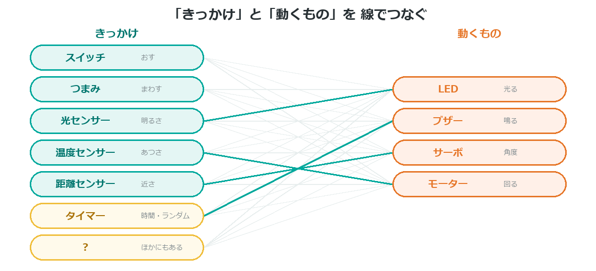

{cover}
# ① なにを作るか決めよう

アイデアを 1文にする

*UIAPduino 体験ワークショップ*

---

# なにをするの？
ここからは**自分だけの作品**をつくるよ。まずは なにを作るか決めよう。

- アイデアの**出し方**を知る
- 大きすぎる構想を**ちょうどよく切る**
- **1文で言える**ところまで しぼる

> 「なんでもいいよ」が いちばん むずかしい。
> だから、**手がかり**をいくつか用意したよ。

---

# 組み合わせて考える

---

# センサーは あとから さがせる
このワークショップ資料で使ったのは、センサーの**ほんの一部**だよ。

- 音・ゆれ・かたむき・磁石・水・けむり・人の気配…
- 「**◯◯を感じたい**」と決まれば、たいていその部品がある
- **作りたいものを先に決めて**、部品はあとからさがすほうがいい

> 知っている部品だけで考えると、アイデアが小さくなってしまう。
> まず「やりたいこと」から考えよう。

> ⚠ 見つけた部品が UIAPduino で使えるかは、メンターと確かめてね。

---

# ほかの さがし方
組み合わせ以外にも、アイデアの手がかりはあるよ。

- **こまっていること**から … 「暗いと見えない」「鳴ると気づく」
- **おもしろいと思ったもの**から … ゲーム・生きもの・きかい
- **だれかのために** … 家族・ペット・クラスのみんな

> 3つのうち、どれか1つでピンとくればいい。
> ピンとこなければ、**組み合わせ表にもどろう**。

---

# 1文で言えたら決まり
アイデアがまとまったら、**1文**にしてみよう。

**「◯◯すると、△△する もの」**

- 「**暗くなると**、**光る** もの」
- 「**近づくと**、**しっぽがふれる** もの」
- 「**つまみを回すと**、**音がかわる** もの」

> 1文で言えないときは、まだ**ぼんやりしている**しるし。
> 言えるまでしぼると、作るときに迷わないよ。

---

# ⚠ 大きすぎたら切る
「ぜんぶ入り」にしたくなるけど、**まず1つ動かす**のが先だよ。

- センサー**1つ**、動くもの**1つ**から始める
- 動いてから、**足していく**
- 時間が足りないときは、**足したものを外せばいい**

> ⚠ 発表の日は決まっている。
> **半分できた作品**より、**小さくても動く作品**のほうが強いよ。

---

# 💪 やってみよう

自分のアイデアを、紙に書き出そう。

1. 思いついたことを **3つ以上**書く（いいわるいは考えない）
2. それぞれを **1文**にしてみる
3. いちばん **作れそう**なものを1つえらぶ

> 💪 となりの人に、1文で説明してみよう。
> 伝わらなかったら、まだしぼりが足りないよ。
