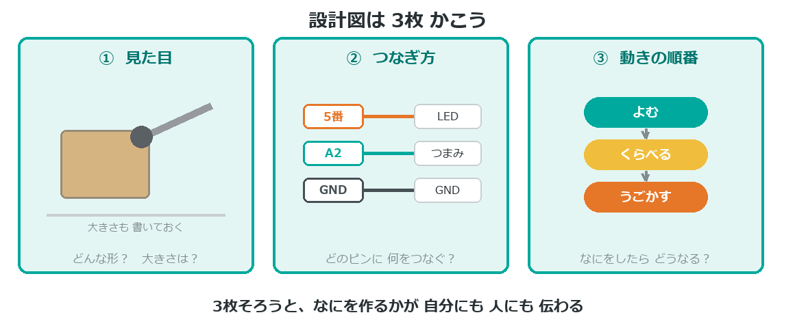

{cover}
# ② 設計図をかこう

頭の中を 紙に出す

*UIAPduino 体験ワークショップ*

---

# なにをするの？
アイデアが決まったら、**作る前に紙に書く**よ。

- **3枚の絵**で、作るものをはっきりさせる
- ピンが**足りるか**を確かめる
- できたかどうかを**自分で判定**できるようにする

> 書かずに作ると、とちゅうで「あれ、どうするんだっけ」となる。
> 紙に出しておくと、**手が止まらない**んだ。

---

# 設計図は3枚

---

# ピンは足りる？
使う部品を数えて、ピンが足りるか確かめよう。

- 明るさを変える部品は **`0` `2` `5` `6` `12`** のどれか
- センサーで値を読むのは **`A0` `A1` `A2` `A3` `A5`** のどれか
- ふつうに光らせる・スイッチは **のこりのピン**

> ⚠ `11` は使わない。`A6` は読めない。
> くわしくは付録③「ピン配置早見表」を見てね。

---

# できること表をつくる
「どこまでできたら完成か」を先に決めておくよ。

- ◯ **かならず入れる** … これがないと作品にならない
- △ **できたら入れる** … 時間があれば
- ✗ **今回はやらない** … 次の作品で

> 先に決めておくと、時間が足りなくなっても**あわてない**。
> △ を外せばいいだけだからね。

> 発表では「◯はできた、△はここまで」と話せばいいんだ。

---

# 💪 やってみよう

3枚の絵を、じっさいに かいてみよう。

1. **見た目** … 形と大きさ。手で持てる？　机に置く？
2. **つなぎ方** … どのピンに 何をつなぐか
3. **動きの順番** … よむ → くらべる → うごかす

> 💪 かき終わったら、メンターに見せて話してみよう。
> **説明できたら、設計図は合格**だよ。
