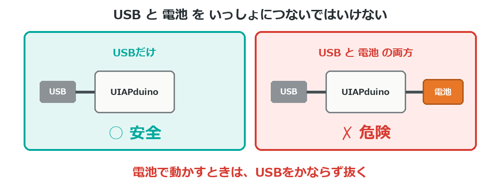
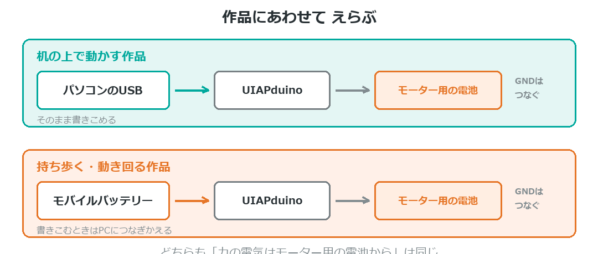
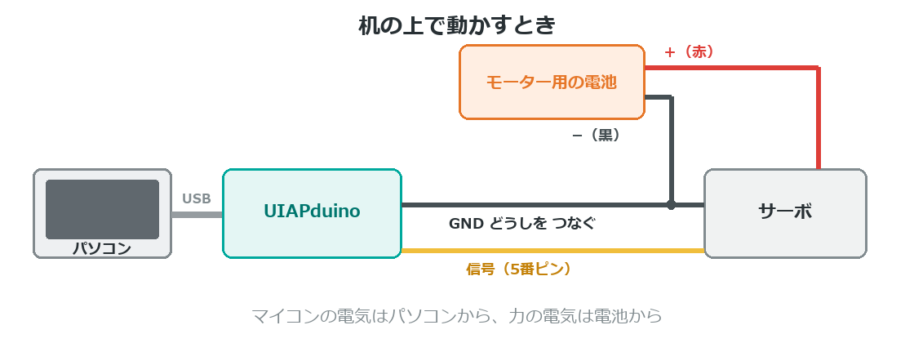

{cover}
# ④ 電源をどうするか

パソコンから はなれて動かす

*UIAPduino 体験ワークショップ*

---

# なにを考えるの？
ここまでは**パソコンのUSB**から電気をもらっていたね。
作品として持ち歩くなら、自分で電気を用意することになる。

- **なにを動かす？** … LEDだけ／サーボ／モーター
- **どれくらいの時間？** … 発表の5分／ずっと
- **持ち歩く？** … 机の上だけなら USB のままでいい

> この3つが決まれば、電源はほとんど決まるよ。

---

# ⚠ いちばん大事なやくそく

:::

**USB と 電池を、いっしょにつないではいけない。**

2つの電源から同時に電気をもらうことになって、**こわれる**おそれがある。

- 電池で動かすとき … **USBを抜く**
- 書きこむとき … **電池をはずす**

> ⚠ 電池をつないだままUSBをさす。これが**いちばん多い事故**。

:::



---

# 作品にあわせてえらぶ



---

# 机の上で動かす作品

:::

**パソコンのUSBのまま**でいい。いちばんかんたんだよ。

- 電源のことを考えなくていい
- プログラムを**書きかえながら**調整できる
- モーターを使うなら、**モーター用の電池はべつに用意**する

> 発表のときだけノートPCごと運ぶ、という手もあるね。

:::



---

# 持ち歩く作品
**モバイルバッテリー**が使いやすいよ。USBでつなぐだけ。

- パソコンにつないでいるのと**同じ状態**になる
- 充電すれば何度でも使える

> ⚠ **止まってしまうモバイルバッテリーがある**。
> 電気をあまり使わない作品だと「もう使っていない」と判断して
> 電気を止めるタイプがあるんだ。

> 止まったら、べつのモバイルバッテリーを試してみよう。
> モーターを積んだ作品なら、止まりにくいよ。

---

# 乾電池を使うとき

:::

単3電池を**3本**（4.5V）なら、**5Vピン**につないで動かせるよ。

1. 電池の**＋**を **5Vピン**へ
2. 電池の**−**を **GND** へ
3. **USBはかならず抜く**

> ⚠ **単3電池4本（6V）はぜったいにダメ。** こわれるよ。
> モーター用の電池を、まちがえてつながないように。

:::

```
単3 × 3本 ＝ 4.5V  … ○ 5Vピンへ
単3 × 4本 ＝ 6V    … ✗ こわれる
```

> 使っていくと電圧が下がるので、後半は力が弱くなることがあるよ。

---

# どれくらい持つの？
わり算1回で、だいたいの時間が分かるよ。

- **電池の容量（mAh） ÷ 使う電気（mA） ＝ 時間**
- 例：2000mAh ÷ 200mA ＝ **10時間**

> ボードだけなら 11mA くらい。でも**モーターが動くと一気にふえる**。
> 発表の時間だけもてばいい、と割りきるのも作戦だよ。

---

# スイッチをつけよう

:::

作品として仕上げるなら、**切れるようにする**のが大事。

- 見せるたびに抜き差しするのは大変
- 使わないときは切っておきたい

**電池の＋の線のとちゅう**に、スライドスイッチを1つ入れるだけ。

> ⚠ 切ったのに動くときは、**USBがささっている**よ。

:::

```
電池の＋ ──[ スイッチ ]── ボードの 5V
電池の−  ─────────────── ボードの GND
```

---

# 💪 やってみよう

自分の作品の電源を決めよう。

1. **なにを動かす？** を書き出す
2. **机の上 or 持ち歩く** を決める
3. 使う電気をたして、**どれくらい持つか**を計算する

> 💪 電池をつなぐ前に、となりの人と**指さし確認**しよう。
> 「USBは抜けてる？」「電池は3本？」「＋と−は合ってる？」

> 電源は、まちがえると部品がこわれる数少ない場所。
> だからこそ、**確かめる習慣**が身につくところでもあるよ。
