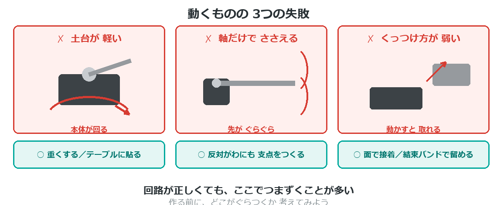

{cover}
# ⑤ 骨格をつくろう

動くものは 土台が9割

*UIAPduino 体験ワークショップ*

---

# なにをするの？
回路ができても、**体がなければ動かない**。
ここでは作品の**骨組み**を考えるよ。

- よくある**3つの失敗**を先に知っておく
- 材料と**くっつけ方**をえらぶ
- サーボやボードを**どう固定するか**決める

> 電気より工作のほうが むずかしい、と感じる人は多いよ。
> ここは**やってみて直す**のがいちばんの近道。

---

# ⚠ 動くものの3つの失敗

---

# 失敗①：土台が軽い
モーターが回ると、**本体のほうが回ってしまう**ことがある。
うでを動かす力と同じ力が、**反対向きに本体へかかる**からだよ。

- 土台を**重くする**（電池を土台に置くと一石二鳥）
- **養生テープでテーブルに貼る**

> 「重くする」だけが答えじゃない。
> **動かないように留める**、という考え方もあるよ。

---

# 材料をえらぶ

---

# くっつけ方をえらぶ

---

# サーボのつけ方

---

# ブレッドボードをどうする
持ち歩くと、**振動でジャンパーが抜ける**。作品にするなら対策がいるよ。

- **両面テープで土台に固定**する … かんたん
- **ユニバーサル基板にはんだ付け**する … 確実

> 抜けかけた線は、**動かなくなる原因の1位**。
> 発表の直前にぬけて、あわてることが多いんだ。

> はんだ付けをしてみたい人は、付録④を見てね。

---

# 100円ショップで探そう
材料は、**売り場を歩いて見つける**のがいちばん楽しいよ。

- 工作コーナー … 木の棒・発泡ボード・ねんど
- キッチン … 使い捨て容器・ストロー・竹串
- 園芸 … 支柱・結束バンド
- 収納 … ケース・すべり止めシート

> **すべり止めシート**は、土台が動くのを止めるのに とても効く。

> 材料をさがすことも、**設計のうち**だよ。

---

# 💪 やってみよう

作る前に、**ぐらつきそうな場所**を見つけよう。

1. 設計図を見て、**動く部分**に印をつける
2. その部分が「①軽い ②軸だけ ③弱い」のどれになりそうか考える
3. 先に対策を決めてから、組み立てる

> 💪 作ってから直すより、**先に考えたほうが早い**。
> でも、やってみて分かることも多いよ。まずは手を動かそう。
