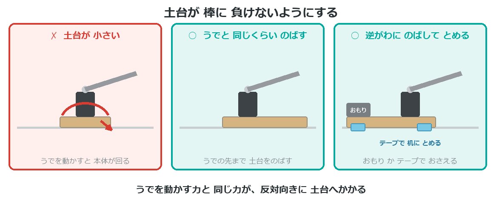
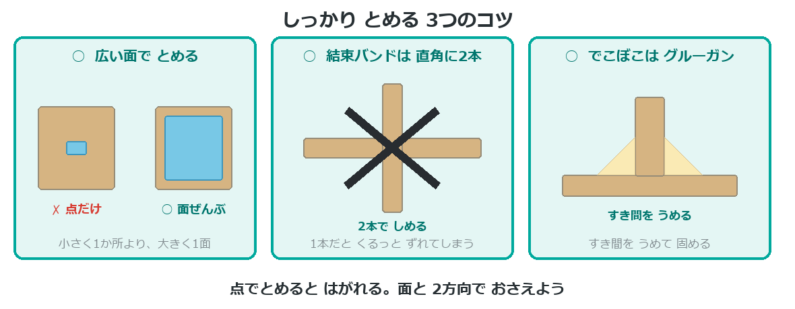
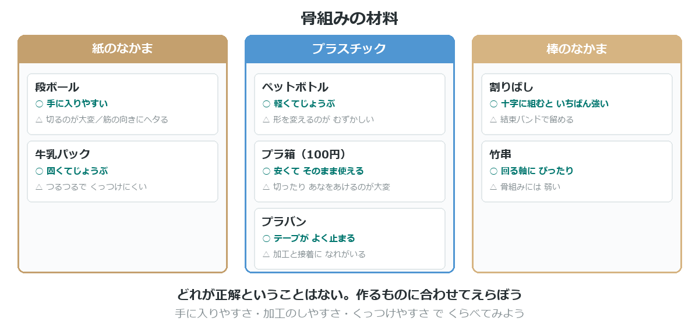
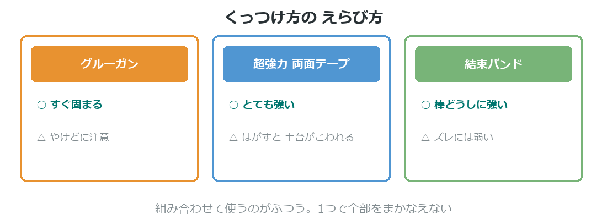
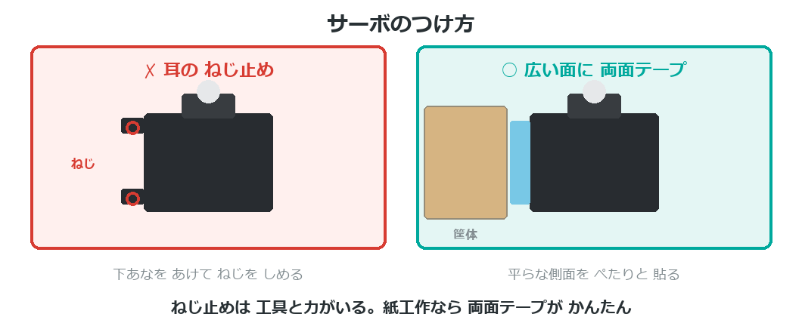
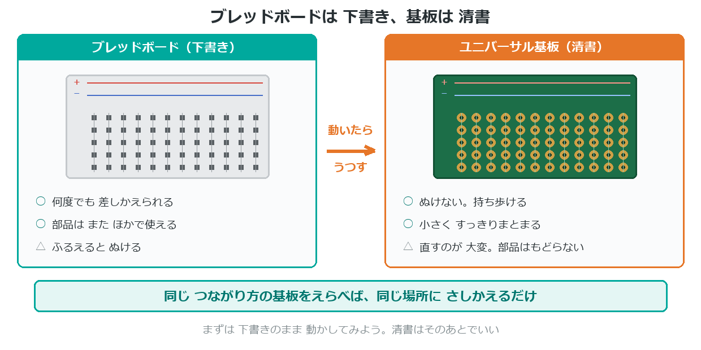

{cover}
# ⑤ 骨格をつくろう

動くものは 土台が9割

*UIAPduino 体験ワークショップ*

---

# なにをするの？
回路ができても、**体がなければ動かない**。
ここでは作品の**骨組み**を考えるよ。

- よくある**3つの失敗**を先に知っておく
- 材料と**くっつけ方**をえらぶ
- サーボやボードを**どう固定するか**決める

> 電気より工作のほうが むずかしい、と感じる人は多いよ。
> ここは**やってみて直す**のがいちばんの近道。

---

# ⚠ 土台が うでに 負ける

---

# 土台のつくり方
うでを動かすと、**土台のほうが動いてしまう**。直し方は2つあるよ。

- うでと**同じくらい**、土台をのばす
- **逆がわ**にのばして、**おもり**か**テープ**でおさえる

> 電池を土台に置くと、おもりのかわりになって一石二鳥。
> **養生テープで机に貼る**のも、発表のときなら十分だよ。

---

# ⚠ しっかり とめる

---

# 材料をえらぶ

---

# くっつけ方をえらぶ

---

# サーボのつけ方

---

# ブレッドボードをどうする
持ち歩くと、**ふるえでジャンパーがぬける**。作品にするなら対策がいるよ。

- **両面テープで土台に固定**する … かんたん
- **ユニバーサル基板にはんだ付け**する … 確実

> ぬけかけた線は、**動かなくなる原因の1位**。
> 発表の直前にぬけて、あわてることが多いんだ。

---

# 下書き と 清書

---

# 同じ並びの基板がある
ブレッドボードと**穴の並びが同じ**ユニバーサル基板が売られているよ。

- 「**ブレッドボード配線パターン**」という名前で探す
- 部品を**同じ場所にさしかえて**、はんだ付けするだけ
- 配線を考え直さなくていい

> はんだ付けのやり方は、**付録④**を見てね。

> 清書は、**発表の前の日**にやると あぶない。
> 早めにうつして、動くことを確かめておこう。

---

# 100円ショップで探そう
材料は、**売り場を歩いて見つける**のがいちばん楽しいよ。

- 工作コーナー … 木の棒・発泡ボード・ねんど
- キッチン … 使い捨て容器・ストロー・竹串
- 園芸 … 支柱・結束バンド
- 収納 … ケース・すべり止めシート

> **すべり止めシート**は、土台が動くのを止めるのに とても効く。

> 材料をさがすことも、**設計のうち**だよ。

---

# 💪 やってみよう

作る前に、**ぐらつきそうな場所**を見つけよう。

1. 設計図を見て、**動く部分**に印をつける
2. その部分が「①軽い ②軸だけ ③弱い」のどれになりそうか考える
3. 先に対策を決めてから、組み立てる

> 💪 作ってから直すより、**先に考えたほうが早い**。
> でも、やってみて分かることも多いよ。まずは手を動かそう。
