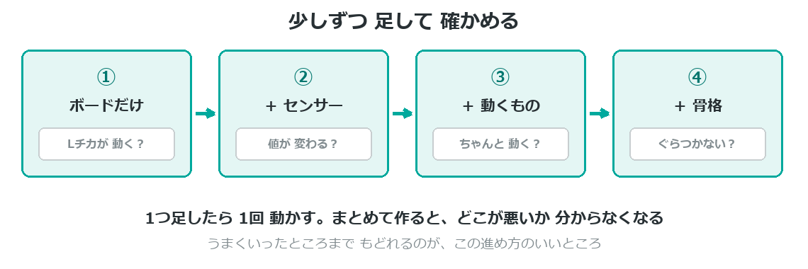

{cover}
# ⑥ くみたてよう

少しずつ 足していく

*UIAPduino 体験ワークショップ*

---

# なにをするの？
材料がそろったら、いよいよ組み立てだよ。

- **少しずつ**足して、そのつど動かす
- 回路と骨格を、**べつべつに**確かめる
- 動かなくなったら、**もどれる**ようにしておく

> いちばんやってはいけないのは、**ぜんぶ作ってから電源を入れる**こと。
> どこが悪いのか、分からなくなってしまうんだ。

---

# 少しずつ足して確かめる

---

# 回路と骨格は べつべつに
同時に作ると、どちらが原因か 分からなくなるよ。

1. **回路だけ**を机の上で組んで、プログラムを確かめる
2. **骨格だけ**を組んで、手で動かして ぐらつきを見る
3. 両方できてから、**合体**させる

> 手で動かしてみると、モーターをつける前に
> 「ここが弱い」と気づけるんだ。

---

# うごかなくなったら
**どこまで動いていたか**を思い出そう。

- **1つ前にもどす** … 動いていたところまで戻して、やり直す
- **LEDで見る** … ここまで来たら光る、を入れてみる
- **配線を1本ずつ**確かめる … 抜けかけが いちばん多い

> こまったときの手順は、付録②にくわしく書いてあるよ。

> **LEDが目のかわり**。ずっと合言葉だったね。

---

# ⚠ 電源を入れる前に
毎回、この3つを指さして確かめよう。

1. **USBと電池を、いっしょにつないでいない？**
2. **＋と−は 合っている？**
3. **となりの線と くっついていない？**

> ⚠ 電源のまちがいは、**部品がこわれる**数少ない失敗。
> めんどうでも、毎回 確かめる価値があるよ。

---

# 💪 やってみよう

作りながら、**記録**をのこそう。

1. うまくいったら、**写真をとる**（もどる場所になる）
2. 変えたことを**メモ**する（数字を変えた、線をつなぎかえた）
3. こまったことも書いておく（**発表のネタ**になる）

> 💪 「うまくいかなかったこと」こそ、聞いていて おもしろい。
> 直した道すじを話せると、かっこいいよ。
