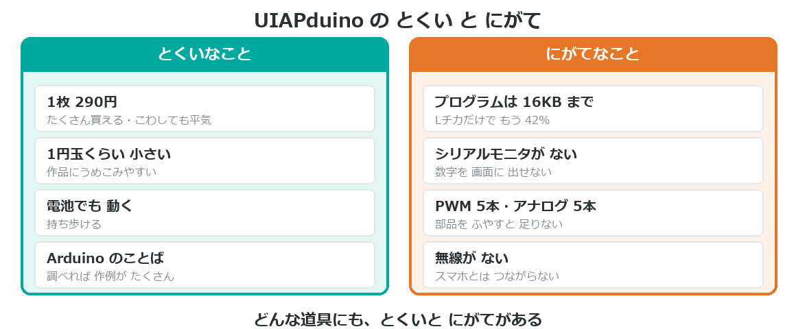
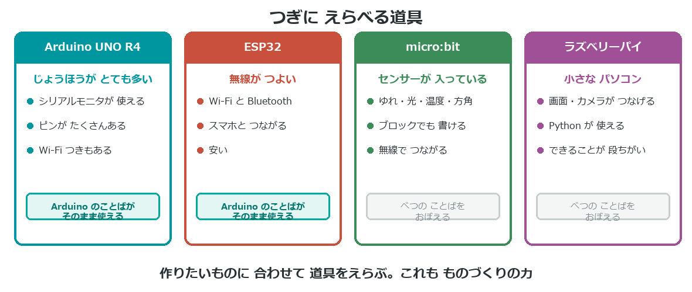

{cover}
# ⑧ つぎの一歩

道具を えらべるようになる

*UIAPduino 体験ワークショップ*

---

# なにをするの？
作品をつくっていると、「**これ、できないのかな**」という場面に出あう。
それは**次に進むサイン**だよ。

- UIAPduino の **とくい**と**にがて**を知る
- 作りたいものに合わせて **道具をえらぶ**
- ここで書いたプログラムは **ムダにならない**

> できないことがあるのは、道具が悪いわけじゃない。
> **道具にはそれぞれ役目がある**んだ。

---

# とくい と にがて

---

# 「できない」と思ったら
まず、**ほんとうにできないのか**を確かめよう。工夫で届くことも多いよ。

- ピンが足りない … **1本のピンで2つ**を切りかえる手もある
- プログラムが入らない … **同じ処理を関数にまとめる**（c4 でやったね）
- 数字が見たい … **LEDの明るさ**で見る（b4 のやり方）

> この教材そのものが、**足りないものを工夫でおぎなった**かたまり。
> `pulseIn` が使えないから、自分で数えるやり方を作ったよね（e3）。

> それでも届かないときが、道具をかえるときだよ。

---

# つぎに えらべる道具

---

# 書いたプログラムは ムダにならない
**UNO R4** と **ESP32** は、**Arduino のことば**で書けるよ。

- `pinMode` `digitalWrite` `analogRead` … そのまま使える
- `for` `if` `関数` … 考え方は どのマイコンでも同じ
- ちがうのは **ピンの番号**と**できることの範囲**だけ

> ここで書いた `kyori()` や `muku()` は、
> つぎのマイコンでも ほとんどそのまま動くんだ。

> **ことばを1つおぼえると、道具が何個も使えるようになる。**
> それが Arduino をえらんだ理由だよ。

---

# それでも UIAPduino がいい場面
大きいマイコンが えらいわけじゃない。**小さいから勝てる**場面があるよ。

- 作品に**うめこむ**（1円玉くらいしかない）
- **たくさん作る**（1枚290円）
- こわれても**平気**（気楽に試せる）

> ロボットの「頭」は大きいマイコン、
> 「指先」は UIAPduino、という組み合わせ方もあるよ。

---

# 💪 やってみよう

つぎに作りたいものを、書き出してみよう。

1. 作りたいものを**1つ**書く
2. それに **何が必要か**を書き出す（センサー・無線・画面…）
3. UIAPduino で**できるか**、べつの道具がいるかを考える

> 💪 「できない」と分かることも、りっぱな成果だよ。
> 何が足りないかが分かれば、**さがし方**が分かる。

> ここまでおつかれさま。きみはもう、**道具をえらべる**人だよ。🎉
