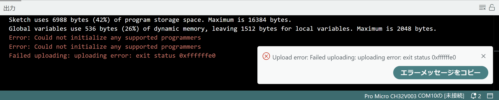
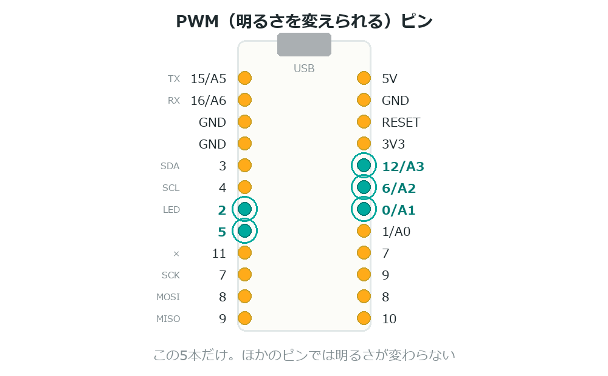
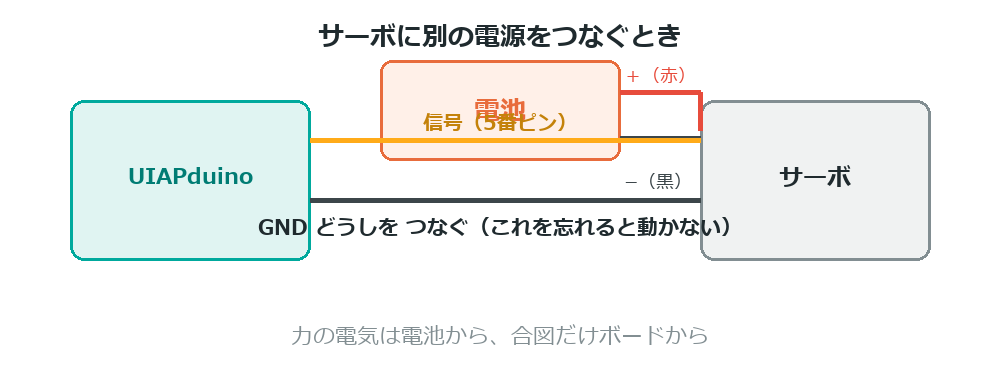

{cover}
# ② こまったときは

よくあるつまずきと直し方

*UIAPduino 体験ワークショップ*

---

# まず、切り分けよう
「動かない」とき、いきなり全部を見直すと迷子になるよ。
**どこまで動いているか**を、1つずつ確かめよう。

1. プログラムは**書きこめた**か（`Image written.` が出たか）
2. プログラムは**動いている**か（LEDが光るか）
3. **部品**は正しくつながっているか

> この順に確かめれば、原因はかならず見つかるよ。

---

# 書きこめない ①

:::

赤い字で **`Could not initialize`** と出たとき。

いちばん多い原因は、**書きこみモードになっていない**こと。

1. USBケーブルを**抜く**
2. **RESETを押しながら**挿して、すぐはなす
3. もう一度 **→（書き込み）** を押す

> ⚠ 「押しながらさす」の順番が大事。何回でもやりなおせるよ。

:::

---

# 書きこめない ②
やりなおしても書きこめないときは、こちらを試そう。

- **USBハブを使わない**（パソコンに直接さす）
- **短いケーブル**に変える
- ケーブルが**充電専用**でないか確かめる
- RESETをはなす**タイミング**を少し変える

> 3回やってもダメなら、メンターをよんでね。

---

# 書きこめたのに動かない
`Image written.` が出たのに、なにも起きないとき。

**RESETボタンを1回押す**のを忘れていないかな。

- 書きこんだだけでは、プログラムは動きださない
- `Image written.` のあとに **RESETをもう1回**

> ⚠ これはこのボード特有の手順。忘れやすいので気をつけて。

---

# LEDが光らない
配線を上から順に確かめよう。

- LEDの**向き**（長い足が＋・ピンがわ）
- **抵抗**が入っているか（1kΩ）
- 抵抗のもう一方が **GND** に入っているか
- ブレッドボードの**穴のグループ**が合っているか
- プログラムの**ピン番号**と、実際にさした場所が同じか

> ⚠ ジャンパー線が**断線**していることもある。別の線に替えてみよう。

---

# 明るさが変わらない

:::

`analogWrite` を使ったのに、点くか消えるかしかしないとき。

- `setup()` に **`analogWriteResolution(8);`** を書いたか
- そのピンは **PWM が使えるピン**か（`0` `2` `5` `6` `12` だけ）

> ⚠ `1` や `10` で `analogWrite` を使うと、**まったく光らない**。
> 明るさを変えたいときは **5番か6番**を使おう。

:::

---

# センサーの値がおかしい
つまみやセンサーが反応しないとき。

- そのピンは **アナログが読めるピン**か（`A0` `A1` `A2` `A3` `A5` だけ）
- ⚠ **`A6` は読めない**（図には書いてあるけれど使えない）
- まん中の足（ワイパー）を読むピンにつないでいるか
- しきい値の**向き**（`<` と `>`）が逆になっていないか

> 反応しないときは、b4 のやり方で**明るさとして値を見る**と分かりやすいよ。

---

# 動かすと再起動する

:::

サーボやモーターを動かしたとたん、LEDが消えるとき。

**電気が足りていない**サインだよ。

- `5V` から取れるのは **500mA** まで（ヒューズが切れると基板交換）
- サーボは力がかかると **700mA** ほど使う

> ⚠ **電池からサーボに電気を送る**。GND だけボードとつなぐ（e4）。

:::

---

# LEDが目のかわり
このボードは**シリアルモニタが使えない**。数字を画面に出せないんだ。
だから、**LEDで確かめる**のがこのボードのやり方だよ。

- ここまで動いた？ → その場所でLEDを光らせる
- 値はいくつ？ → `analogWrite` で**明るさ**にして見る
- 何回目？ → その回数だけ**点滅**させる

> こまったときは「**LEDを光らせてみる**」。これがずっと合言葉だったね。

---

# それでもダメなら
- **1つ前にもどす** … 動いていたところまで戻して、1つずつ進める
- **部品をかえる** … LED・ジャンパー・ブレッドボードを別のものに
- **かんたんな例で試す** … `i3_blink` のような最小のプログラムに戻す

> どこまで動いていたかが分かれば、それだけで**大きな前進**だよ。

> メンターに相談するときは「**どこまで動いて、どこで止まったか**」を
> 伝えると、いっしょに早く見つけられるよ。
