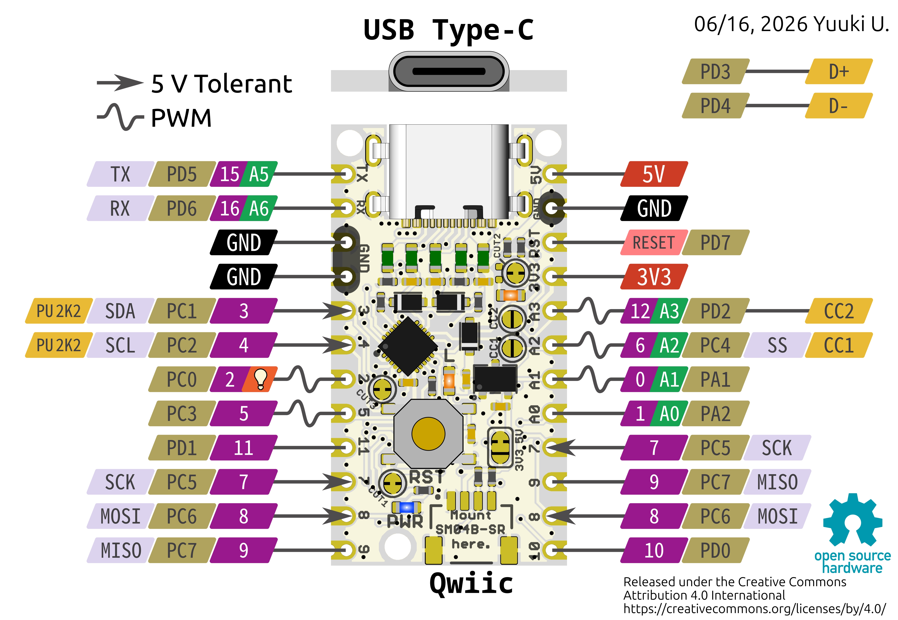

{cover}
# ③ ピン配置早見表

どのピンが何に使えるか

*UIAPduino 体験ワークショップ*

---

# 公式のピン配置図

:::

これが UIAPduino Pro Micro の**ピンの地図**だよ。
作った人（Yuuki U. さん）が公開しているものなんだ。

配線に迷ったら、いつでもここに戻ってこよう。

> このページは印刷して手もとに置いておくと便利だよ。

:::

---

# 図の読み方

:::

ピンひとつひとつに、いくつもの名前がついている。

- **むらさきの数字** … プログラムで使う**ピン番号**（`2` `5` `7` など）
- **みどりの `A◯`** … **アナログ入力**にも使える印
- **うすい黄土色の `P◯◯`** … マイコンの中での名前（`PC0` など。ふだんは気にしなくてOK）
- **うすむらさき** … 特別な役目（`SDA` `SCK` `TX` など）

記号の意味は左上に書いてあるよ。

- **∿（波の形）** … **PWM**（明るさ・速さを変えられる）
- **→（矢印）** … 5V をつないでもこわれないピン

:::

> 📷 図の一部分を拡大して、色の意味を矢印で示した画像（Greenshotで注釈）

---

# よく使うピン

:::

このワークショップで使うのは、だいたいこの5種類。

- **`2`** … 基板のオレンジLED（電球のマーク💡がついている）
- **`5` `6`** … LEDの明るさを変えるときに使う（**PWM が使える**）
- **`7` `8` `9`** … ふつうに光らせる・読みとる（PWM は使えない）
- **`3`** … スイッチをつなぐ
- **`A2`（＝ `6`）** … つまみや光センサーをつなぐ

> `6` は「デジタルの6番」と「アナログの A2」の**両方の顔を持つ**ピン。
> どちらの名前で書いてもいいよ。

:::

> 📷 ブレッドボードに部品をつないだ写真（どのピンを使ったか番号を書きこむ）

---

# PWM が使えるピン

:::

**PWM**（明るさや速さを、とちゅうの強さで変えるしくみ）が使えるのは、この5本だけ。

- **`0`** `1`ではないので注意
- **`2`**（基板のLED）
- **`5`**
- **`6`**（＝ `A2`）
- **`12`**（＝ `A3`）

> ⚠ この5本以外で `analogWrite` を書くと、明るさが変わらないだけでなく
> **まったく光らない**ピンもあるよ（`1` と `10` がそう）。
> LEDがふわっと光らないときは、まずピン番号をうたがってみよう。

> `analogWrite` を使うときは、`setup()` に `analogWriteResolution(8);` を入れて
> 明るさを **0〜255** で指定できるようにしておこう。

:::

> 📷 PWM が効くピンと効かないピンで、LEDの見え方を比べた写真（2枚）

---

# アナログ入力が使えるピン

:::

`analogRead` で **0〜1023** の値が読めるのは、この5本。

- **`A0`**（＝ `1`）
- **`A1`**（＝ `0`）
- **`A2`**（＝ `6`）… このワークショップでよく使う
- **`A3`**（＝ `12`）
- **`A5`**（＝ `15`）… `TX` と共用

> ⚠ `A4` `A6` `A7` は**使えない**。図には `A6` があるけれど、
> いまの Arduino のプログラムでは読みとれないんだ。

:::

> 📷 可変抵抗を A2 につないだ写真

---

# ⚠ 気をつけるピン

:::

つないではいけない・気をつけるピンがあるよ。

- **`11`** … デバッグ用の信号（**SWIO**）とかさなっている。使うには `setup()` の先頭に
  `pinV32_DisconnectDebug(PD_1);` を書く必要がある（SWIOは使えなくなる）。**このワークショップでは使わない**
- **`3` `4`** … 基板の中で 2.2kΩ の抵抗がつながっている（I2C用）。
  スイッチには使えるけど、**アナログ入力には向かない**
- **`RESET`** … ボタン専用。プログラムからは使えない
- **`5V` `3V3` `GND`** … 電源のピン。**ここにLEDの足を直接さしてはいけない**

> ⚠ `7` `8` `9` は**基板の左と右の両方に出ている**（同じピンが2か所にある）。
> どちらにさしても同じだよ。

:::

> 📷 基板の左右で 7・8・9 が重複していることを示した写真

---

# 番号がとんでいるところ

:::

ピン番号は `0` から順に、とちゅうまで続いている。

- 使えるのは **`0` 〜 `12`** と **`15` `16`**
- **`13` `14` `17` は欠番**（そのピンは基板に出ていない）
- `PD3` `PD4` は **USB の通信**に使われているので、部品はつなげない

> 番号がとんでいるのは、小さなマイコンにたくさんの役目を持たせているから。
> 「ないものはない」とおぼえて、図を見ながら使えるピンを選ぼう。

:::

> 📷 使えるピンだけを色分けした図（公式図をもとに作る）

---

# 出典とライセンス

:::

このページのピン配置図は、UIAPduino を作った **Yuuki U.** さんが公開しているものです。

- 作品名：UIAPduino Pro Micro CH32V003 ピン配置図
- 作者：Yuuki U.（UIAP Project）
- ライセンス：**Creative Commons 表示 4.0 国際（CC BY 4.0）**
- `https://creativecommons.org/licenses/by/4.0/`
- 公式ページ：`https://www.uiap.jp/uiapduino/pro-micro/ch32v003/v1dot4`

> このライセンスは「**作者の名前を書けば、自由に使ってよい**」というもの。
> オープンソースハードウェアのマークもついているよ。

> ⚠ この画像だけは、この教材ぜんたいの MIT ライセンスとは**別あつかい**です。
> 使いまわすときは、上の作者名とライセンスもいっしょに書いてね。

:::

> 📷 このスライドは文字だけでOK
