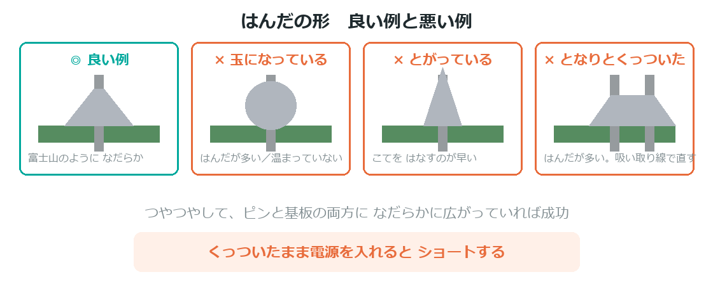

{cover}
# ④ ピンヘッダをはんだ付けしよう

自分でボードを買った人むけ

*UIAPduino 体験ワークショップ*

---

# ⚠ 大人といっしょに
はんだごての先は **300℃以上**。やけどをすると本当に痛いよ。

- かならず**大人といっしょに**やること
- ワークショップで配るボードは**はんだ付けずみ**なので、
  この章をやる必要はないよ

> ここは「自分でボードを買って、続けたい人」のためのページだよ。

---

# 用意するもの

:::

- **はんだごて**（30W くらい・温度調節つきだとなお良い）
- **こて台** … 置くところ。安全のために必ず用意する
- **はんだ**（Φ0.6〜0.8mm の細いもの）
- **ピンヘッダ**（2.54mmピッチ）
- ぬれたスポンジ、またはこて先クリーナー

> あると便利：はんだ吸い取り線（やり直すとき）、ピンセット

:::

> 📷 道具一式を並べた写真

---

# 安全のやくそく
- こては**使わないとき必ずこて台に**置く
- こて先を**絶対にさわらない**（見た目では熱さが分からない）
- はんだの**煙を直接吸わない**（換気する）
- 終わったら**電源を抜く**。冷めるまで片づけない

> ⚠ 熱いこてを持ったまま歩かない・人に向けない。

---

# まっすぐ付けるコツ

:::

ピンヘッダが**かたむく**と、ブレッドボードにささらなくなるよ。

1. **ブレッドボードにピンヘッダをさす**
2. その上からボードをかぶせる
3. この状態ではんだ付けする

> ブレッドボードが治具（じぐ）のかわりになって、
> **自然にまっすぐ**になるんだ。

:::

> 📷 ブレッドボードにさしてからボードをのせた状態の写真

---

# はんだ付けのやり方

:::

順番が大事だよ。**はんだをこてに付けるのではない**。

1. こて先を **ピンと基板の両方**に当てる（1〜2秒）
2. **あたたまったところ**にはんだを近づける
3. はんだが溶けて流れたら、はんだをはなす
4. そのあと**こてをはなす**

> ⚠ 1か所につき **3秒以内**。長く当てると基板が傷むよ。

:::

> 📷 こて先とはんだの当て方を横から撮った写真

---

# 良い例・悪い例

:::

**良い例** … 富士山のようになだらかに広がっている

**悪い例**

- **玉になっている** … はんだが多すぎ／温まっていない
- **とがっている** … こてをはなすのが早い
- **となりとくっついた** … はんだが多すぎ（吸い取り線で直す）

> ⚠ 見た目がつやつやしていれば、たいてい成功だよ。

:::

---

# やり直したいとき

:::

失敗しても大丈夫。やり直せるよ。

- **吸い取り線**をはんだの上に当て、その上からこてを当てる
- はんだが吸い取り線にうつったら、いっしょにはなす
- きれいになったら、もう一度つけ直す

> ⚠ 何度もやり直すと基板が傷む。**3回まで**を目安に、
> うまくいかないときは大人に見てもらおう。

:::

> 📷 吸い取り線を使っているところの写真

---

# 最後に確かめよう

:::

電源を入れる前に確認しよう。

1. **となり同士がくっついていないか**（横から見る）
2. ピンがぐらついていないか
3. ブレッドボードにすんなりささるか

> ⚠ くっついたまま電源を入れると**ショート**する。必ず確かめて。

:::

> 📷 横から見てブリッジ（くっつき）を確認している写真
