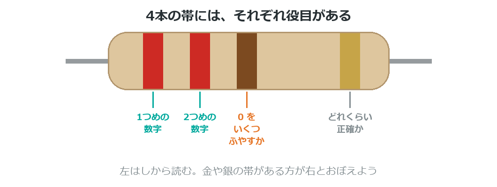
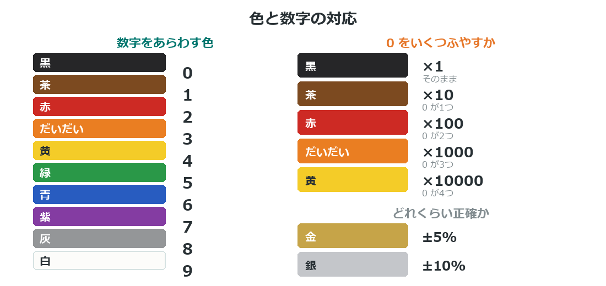
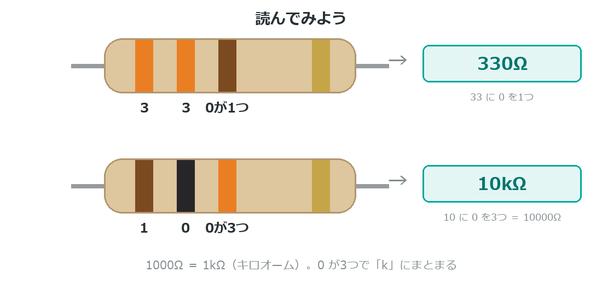
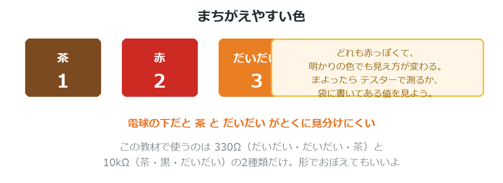

{cover}
# ⑥ 抵抗のカラーコードの読み方

色の帯で値がわかる

*UIAPduino 体験ワークショップ*

---

# なぜ色で書いてあるの？
抵抗は小さすぎて、数字を印刷しても読めないんだ。

- だから**色の帯**で値をあらわしている
- 世界共通のきまり。どこの国の抵抗でも同じ読み方
- 抵抗に向きはないので、**どちらから読むか**の目印もいる

> この教材で使うのは **330Ω** と **10kΩ** の2種類だけだよ。

---

# 4本の帯の役目

:::

帯は4本。それぞれ役目がちがうんだ。

1. **1つめの数字**
2. **2つめの数字**
3. **0 をいくつふやすか**
4. **どれくらい正確か**（誤差）

> 金や銀の帯がある方が**右**。そこを最後に読むよ。

:::

---

# 色と数字の対応

:::

**黒・茶・赤・だいだい…** の順に 0・1・2・3 とふえていくよ。

- 1本目と2本目 … 色がそのまま**数字**になる
- 3本目 … **0 をいくつふやすか**
- 金 … **±5%**。ふつうの抵抗はこれ

> 全部おぼえなくていい。**必要なときに見にくればOK**だよ。

:::

---

# 読んでみよう

:::

この教材で使う2つを、じっさいに読んでみよう。

**330Ω** … だいだい・だいだい・茶
→ `3` `3` に 0 を1つで **330**

**10kΩ** … 茶・黒・だいだい
→ `1` `0` に 0 を3つで **10000**

:::

---

# ⚠ まちがえやすい色

:::

**茶・赤・だいだい** は、どれも赤っぽくて見分けにくい。

- 明かりの色によって見え方が変わる
- 電球の下だと、茶 と だいだい はとくに似て見える

> ⚠ まよったら、**袋に書いてある値**を見るのが確実。
> テスターがあれば、測るのがいちばん早いよ。

:::

---

# 💪 やってみよう

手元の抵抗を、自分で読んでみよう。

1. 金の帯を**右**にして持つ
2. 左から順に、色を数字に置きかえる
3. 3本目の色のぶんだけ **0 をふやす**

> 💪 330Ω と 10kΩ を混ぜて、目だけで見分けられるか試してみよう。

> 100Ω は **茶・黒・茶**。1kΩ は **茶・黒・赤**。読めるかな？
