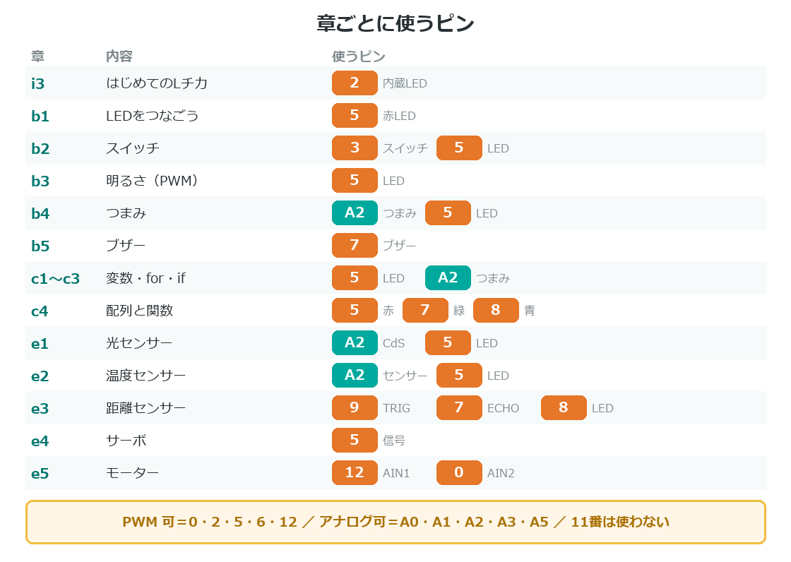

{cover}
# ⑦ メンター用 早見表

当日、手元に置いておくページ

*UIAPduino 体験ワークショップ*

---

# 章ごとに使うピン

---

# つまずきどころ Top 5

:::

当日の質問は、ほぼこの5つ。

1. **書きこみモードにしていない**
2. **書きこんだあと RESET を押していない**
3. **`analogWriteResolution(8);` がない**
4. **PWM が使えないピン**で `analogWrite`
5. **`INPUT_PULLUP` は押すと 0**

> 1と2はこのボード特有。**最初の30分はこれだけ**と思っていい。

:::

---

# 切り分けの順番
「動かない」と言われたら、この順に聞く。

1. **書きこめた？**（`Image written.` が出たか）
2. **RESET を押した？**
3. **LEDは光る？**（プログラムが動いているか）
4. **配線は？**（向き・抵抗・GND・ピン番号）

> 順番を守ると、原因が半分ずつ減っていくよ。
> 付録②「こまったときは」に、各段階の対処がある。

---

# 時間の目安

**半日（3時間）**

- 導入編 … 75分（IDE準備に時間がかかる）
- 基本編 b1〜b4 … 105分

**1日（6時間）**

- ＋ 基本編 b5 … 20分
- ＋ 制御編 c1〜c4 … 105分

> IDEのインストールは**事前にすませておく**と、導入編が30分縮まる。

---

# 事前に用意すること
当日あわてないための準備。

- PCに **Arduino IDE ＋ UIAPduino のボードパッケージ**を入れておく
- ボードを1枚**書きこみテスト**しておく（USBケーブルの相性確認）
- 抵抗は **1kΩ** と **10kΩ** を色で分けて配る
- 予備のジャンパーワイヤーを多めに（**断線がいちばん多い**）

> ⚠ USBケーブルは「充電専用」だと書きこめない。**全部テストしておく**。

---

# 声のかけ方
手が止まっている子には、答えではなく**次の一手**を渡す。

- 「どこまで動いた？」… 切り分けの習慣がつく
- 「LEDで見てみようか」… このボードのデバッグ方法
- 「1つ前にもどしてみよう」… 動いていた地点に帰る

> できた子には 💪 を案内する。各章の最後にあるよ。
